<div align="center">

# 恋的 Arch 配置

> 我使用的桌面环境是 `Hyprland` + `wayland` + `kitty` + `zshell`


如果你的环境和我一样, 可以直接抄作业!

</div>

---

#### 说明:

这个文档会详细的说明我的每一个目录配置, 你可以直接下载到 `~/.config/` 下使用

我的大部分软件是在 `hyprland.conf` 中配置了 `exec-once` (随 `hyprland` 启动)

还有一小部分 (例如 `sddm` `bluetooth` `polkit` `wpa_supplicant`) 要在用户登录前启动, 所以配置为 `systemd enable`

---

## | fastfetch

这是一个在终端打印输出系统信息的包, 效果如下:

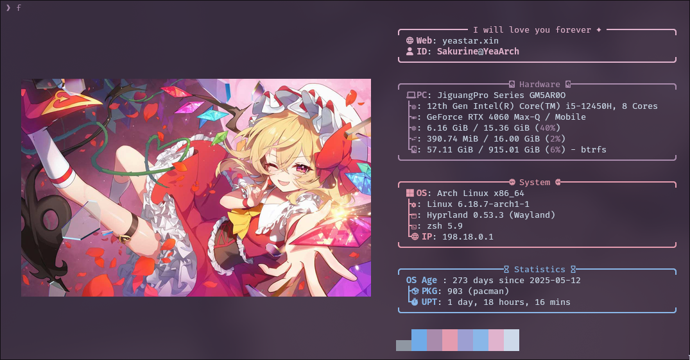

###### 你可以使用 `pacman` 进行安装:

```bash
sudo pacmna -S fastfetch
```

我的配置目录如下:

```
 fastfetch
├──  config.jsonc              # 基本的样式配置
├──  logo                      # 存放 logo 图片的目录
└──  scripts
    ├──  fastfetch-age.sh      # 获取系统使用时间的脚本
    ├──  fastfetch-ip.sh       # 获取系统 IP 地址的脚本
    └──  fastfetch-logo.sh     # 从 logo/ 目录中抽图片
```

* 如果你想使用默认的logo, 那么直接删除 `logo/` 目录即可
* 系统使用时间我在脚本里硬编码了从 `2025-05-12` 日开始计算, 你可以自己更改

## | fcitx5

`fcitx5` 是最出名的输入法框架, 我的配置里使用了 `rime` 输入引擎, 以及 `rime-ice` 雾凇拼音输入方案

```bash
sudo pacman -S fcitx5 fcitx5-configtool fcitx5-gtk fcitx5-qt fcitx5-rime
paru -S rime-ice-git
```

将我的配置文件放入 `~/.local/share/fcitx5/rime/default.custom.yaml`

他只有一个目的: 取消 `rime` 默认的 `Shift` 切换中英文

##### 我推荐你直接使用 `fcitx5` 级别的切换中英, 输入 `fcitx5-configtool` 打开图形化配置页面 (或自己编辑配置文件)

1. 确保 **当前输入法列表** 中包含: `键盘 - 英语 (美国)` 和 `中州韵 (Rime)`
2. 在 **全局选项** 里, 配置 切换输入法 的快捷键

##### 关于 `fcitx5` 主题

我使用的主题是 [ayaya](https://github.com/witt-bit/fcitx5-theme-ayaya), 这里不做详细教学

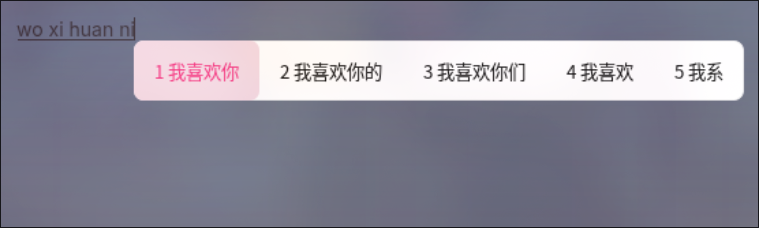

## | GRUB

我的 `GRUB` 只做了主题配置, 是用的是 [suiGRUB](https://www.gnome-look.org/p/2219756)

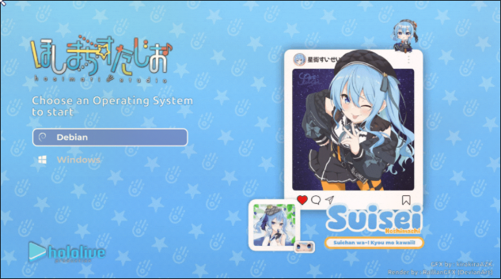

## | sddm

`sddm` 是一款基于 `QML` 的显示管理器, 我使用他作为我的登录管理器

###### 使用 `pacman` 安装 - 并且设置开机自启

```bash
sudo pacman -S sddm
sudo systemctl enable sddm
```

##### 我使用的主题是 [sddm-astronaut-theme](https://github.com/Keyitdev/sddm-astronaut-theme/), 他是一个 `sddm` 主题库

我使用的是其中的 `hyprland_kath` 主题, 因为嫌其他主题太冗余, 就直接删掉了

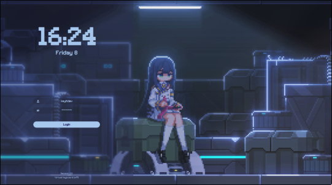

你可以直接把我的 `sddm/themes/sddm-astronaut-theme` 复制到 `/usr/sddm/themes` 

然后编辑 `/etc/sddm.conf`, 写入:

```ini
[Theme]
    Current=sddm-astronaut-theme
```

##### 无法登录问题

如果你也使用 `sddm-astronaut-theme`, 那么可能遇到一个登录问题: **用户名显示全大写, 而实际用户名是包含大小写的**

这个问题在 [issues #58](https://github.com/Keyitdev/sddm-astronaut-theme/issues/58) 中提及, 需要修改对应主题的 `conf` 文件

配置这个字段 `AllowUppercaseLettersInUsernames="false" `

## | zsh

`zsh` 是一款强大的 shell 程序

我的配置主要由三部分组成：

- 一些更顺手的命令行工具（`eza` / `bat` / `dust` / `fastfetch`）
- 提示符与目录跳转（`starship` / `zoxide`）
- zsh 插件与补全（`zsh-completions` / `zsh-autosuggestions` / `zsh-syntax-highlighting`）

###### 安装（Arch Linux）

```bash
sudo pacman -S --needed \
	zsh \
	starship zoxide \
	eza bat dust fastfetch \
	zsh-completions zsh-autosuggestions zsh-syntax-highlighting
```

> 说明：
> - 我在 `.zshrc` 里是从 `/usr/share/zsh/plugins/...` 读取插件的，所以你需要安装上面这三个 `zsh-*` 包。
> - `fastfetch` 负责我每次打开终端自动展示系统信息（`.zshrc` 最后有一行 `f`）。

##### 启用 zsh（可选）

如果你想把 zsh 设为默认 shell：

```bash
chsh -s /bin/zsh
```

##### 配置文件位置

我的 `.zshrc` 里用到的关键点：

- 历史记录：写入到 `~/.config/zsh/zsh_history`，建议先建目录

```bash
mkdir -p ~/.config/zsh
```

- 别名：
	- `ls` → `eza`（带图标、git 状态）
	- `cat` → `bat` (更好的 cat)
	- `du` → `dust` (更优雅的查看磁盘占用)
	- `f` → `fastfetch` (上文有介绍)

- 增强：
	- `compinit` + `zsh-completions`：补全增强
	- `zsh-autosuggestions`：自动建议
	- `zsh-syntax-highlighting`：语法高亮

- 体验：
	- `starship`：提示符
	- `zoxide`：目录跳转（我把 `cd` alias 成了 `z`，以及 `cdi` → `zi`）

## | kanshi

这是一个智能的显示器管理器, 如果你有多个显示器, 用他来管理是个很不错的方案!

###### 使用 `pacman` 进行安装

```bash
sudo pacman -S kanshi
```

我推荐你直接在 `~/.config/hypr/hyprland.conf` 中加入 `exec-once = kanshi` 来启动他

我的配置文件只有一个, 内容如下:

```ini
profile {
	output eDP-1 enable mode 2560x1440@165 position 0,0
}

profile {
	output eDP-1 disable
	output HDMI-A-1 enable mode 1920x1080@180 position 0,0
}
```

我有笔记本显示器 `eDP-1` 和外接显示器 `HDMI-A-1`, 策略是有外接显示器时笔记本就熄屏

## | kitty

`kitty` 是一个支持 真彩色, 光标拖尾, 更强控制序列的终端

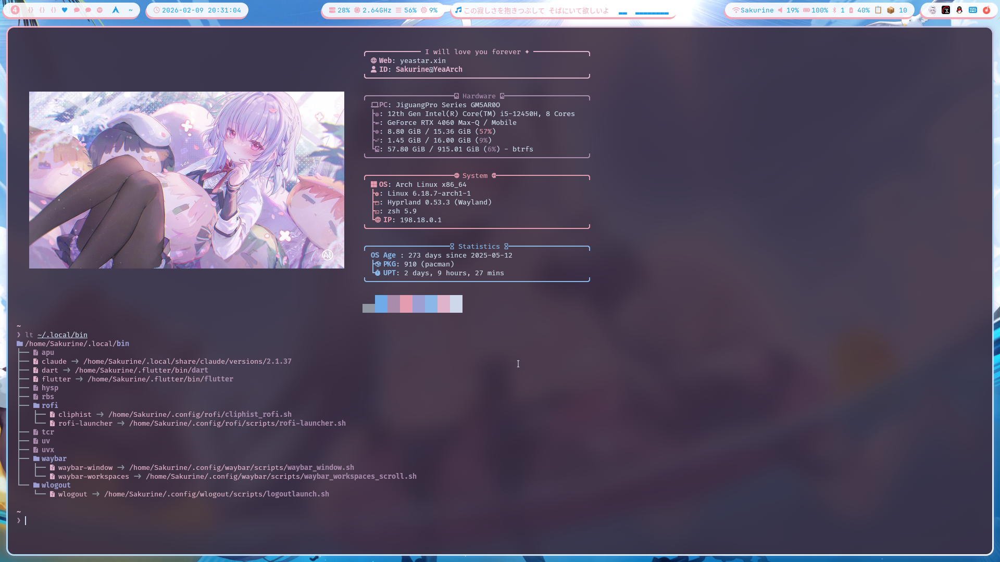

###### 使用 `pacman` 安装

```bash
sudo pacman -S kitty
```

我的配置文件非常简单, 我使用 `kitty-theme` 挑选了自己喜欢的主题, 然后自己配置了一些 字体, 光标拖尾

```
 kitty
├── 󱁻 current-theme.conf    # 终端主题
├── 󱁻 dark-theme.auto.conf
└── 󱁻 kitty.conf            # 配置文件
```

如果你想要安装我的字体

```bash
sudo pacman -S ttf-fira-code
```

这是一款非常适合编程的字体, 支持连字

##### 使用 `kitty` 进行 ssh 连接

`kitty` 拥有自己专属的终端类型 `xterm-kitty`

所以如果你直接 ssh 服务器, 大概率会报警 `WARNING: terminal is not fully functional` `'xterm-kitty': unknown terminal type` ...

`kitty` 官方推荐的解决方案是, 将 terminfo 安装到你要 ssh 的远端设备上

```bash
kitty +kitten ssh 用户@地址
```

## | rofi

`rofi` 是一款应用程序启动器, 我用它做了应用启动菜单, 窗口切换菜单, 剪贴板

| 应用菜单 | 剪贴板 |
|-|-|
|  |  |

###### 使用 `pacman` 安装

```bash
sudo pacman -S rofi-wayland
```

##### 我的目录结构如下

```
 rofi
├──  clipboard.rasi        # 剪贴板 窗口主题
├──  cliphist_rofi.sh      # 启动 剪贴板 脚本
├──  images
│   └──  pln.jpeg          # logo
├──  sakurine.rasi         # app, window 窗口主题
└──  scripts
    └──  rofi-launcher.sh  # 启动 app, window 窗口脚本
```

如果你要使用剪贴板脚本的话, 还需要安装以下包:

```bash
sudo pacman -S cliphist wl-clipboard imagemagick papirus-icon-theme ttf-jetbrains-mono-nerd xdg-utils
```

* `cliphist`: 剪贴板历史
* `wl-clipboard`: 写入剪贴板 (提供 `wl-copy`)
* `imagemagick`: 提供 `magick/convert` (没装也能用, 只是二进制图片预览可能不生成缩略图)
* `papirus0icon-theme`: 图标主题
* `ttf-jetbrains-mono-nerd`: 字体
* `xdg-utils`: 提供 `xdg-open`

## | swaync

`swaync` 是一个通知中心, 他通过监听 `D-Bus` 来获得实时的消息显示

| 消息通知弹窗 | 通知中心 |
|-|-|
| 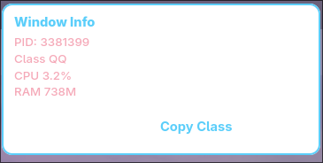 <br>  | 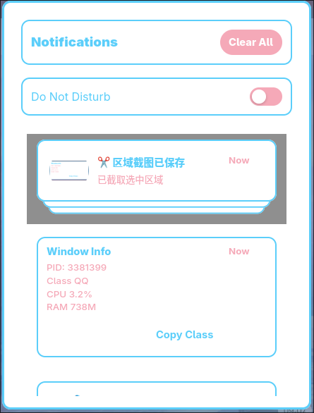 |

###### 使用 `paru` 安装

```bash
paru -S swaync
```

我的配置文件非常简单, 直接 `cp` 就可以使用

## | hyprlock

`hyprlock` 是一个简单的锁屏软件

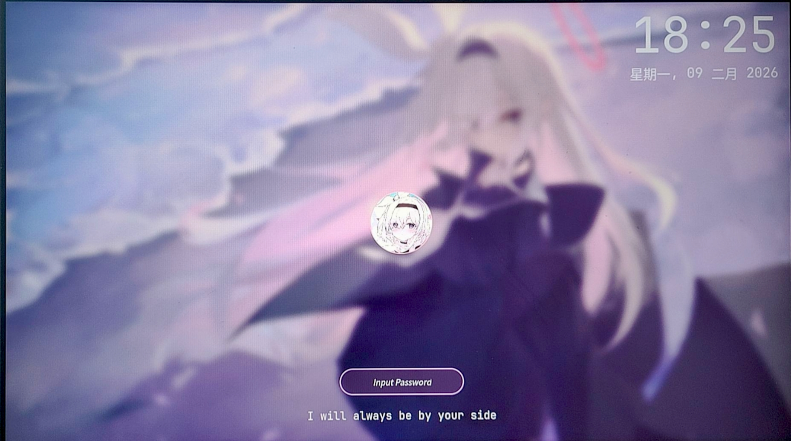

###### 使用 `pacman` 安装

```bash
sudo pacman -S hyprlock
```

如果你想要获得和我一样的效果, 还需要安装这个字体:

```bash
sudo pacman -S ttf-jetbrains-mono-nerd
```

## | wlogout

`wlogout` 提供了一个电源管理页面, 我的配置里分别是 `锁屏` `登出` `关机` `重启`

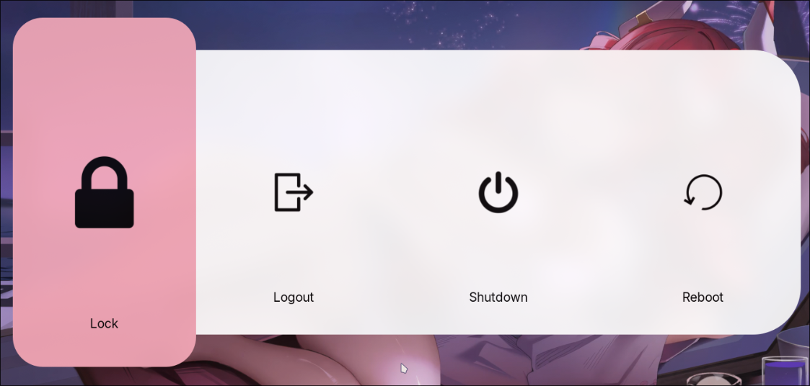

###### 使用 `pacman` 安装

```bash
sudo pacman -S --needed wlogout jq gettext procps-ng
```

锁屏功能 依赖 `hyprlock` 运行, 关机功能则依赖于 `hyprland`

```
 .
├──  icons                 # 图标
├── 󰡯 layout                # 布局
├──  scripts
│   ├──  logoutlaunch.sh
│   └──  wlogout.sh
└──  style.css
```

## | Hyprland

本次配置的重头戏之一, `hyprland` 是我心目中最 **linux** 的桌面环境

###### 使用 `pacman` 安装 (可能会漏掉一些包, 请以 hypr.land 为准)

```bash
sudo pacman -S hyprland xdg-desktop-portal-hyprland xdg-desktop-portal-gtk qt5-wayland qt6-wayland polkit-gnome
```

* `hyprland`: 混成器, 充当窗口管理器, 也是显示服务器
* `xdg-desktop-portal-hyprland`: Hyprland 与 应用 沟通的桥梁
* `xdg-desktop-portal-gtk`: 提供文件选择对话框
* `qt5/6-wayland`: 让基于 qt 框架的应用能跑在 wayland 上 
* `polkit-gnome`: 当你执行需要 sudo 权限的 gui 应用时跳出弹窗

关于 `hyprland` 配置详解, 可以直接 [跳转](./hypr/hyprland.conf) 查看注释, 但这里还是做一个简单介绍

* **修复区:** 这里定义了一些杂项修复
* **窗口规则:** 定义了窗口弹出时的行为, 例如浮动模式弹出, 弹出时的窗口大小 ...
* **NVIDIA:** NVIDIA 显卡的修复, 如果你刚开始觉得渲染网页, 调度GPU卡顿是正常的, 几天后还卡顿那就不正常了(
* **QT变量:** 为了让 QT 高效运行在 wayland 高分屏上的配置
* **全局变量:** hyprland 的配置文件支持使用变量, 建议把你常用的目录全部定义为变量 (例如截图保存目录, 脚本目录)
* **自动启动:** 随着 hyprland 一起启动的软件
* **窗口外观:** 定义窗口的圆角, 边框, 颜色, 动画 ...
* **快捷键:** 这部分建议直接抄作业

你可以直接把 配置文件 丢给 AI 问, 如果有一些软件 AI 不认识 (比如 `lianwall`), 那是正常的

因为这些是我自己写的软件, 在我的 [Github](github.com/Yueosa) 主页可以找到

还有一些快捷键绑定的脚本, 他们是来源于 `rofi` `waybar` ...

## | nvim

`nvim` 是一款比 `vim` 更强的文本编辑器, 我目前对他进行了 `rust` 和 `markdown` 的定制化

| rust 开发体验 | markdown 体验 |
|-|-|
| 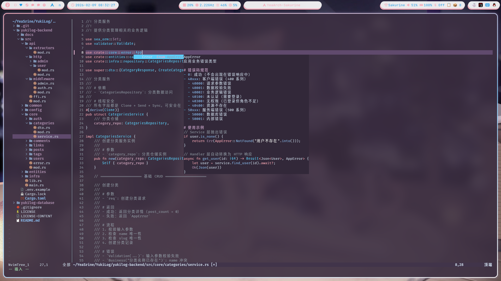 | 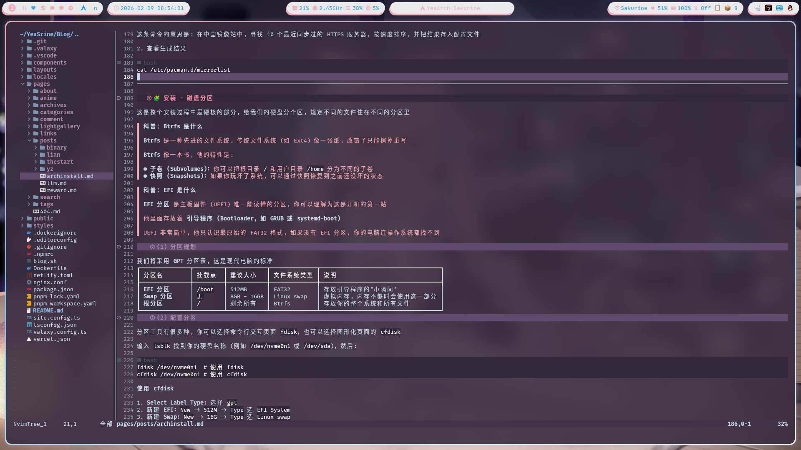 |

###### 使用 `pacman` 安装

```bash
sudo pacman -S nvim
```

我的 Neovim 配置入口在 `nvim/`，你可以直接把它放到：

```bash
cp -r ./nvim ~/.config/nvim
```

如果你已经有自己的 nvim 配置，也可以只抄 `lua/` 里的模块结构。

##### 目录结构

```
 nvim
├──  init.lua
├──  lua
│   ├──  core
│   │   ├──  options.lua      # 基础选项（缩进/行号/分屏方向等）
│   │   ├──  autocmds.lua     # 全局自动命令
│   │   └──  keymaps.lua      # 全局快捷键（插件内快捷键就近写）
│   └──  plugins
│       ├──  init.lua         # lazy.nvim 引导 + 聚合 specs
│       └──  specs            # 每类插件一个文件（便于维护）
└──  sakurine                 # 我自己写的主题（colorscheme），不是第三方主题包
		├──  autoload
		└──  colors
```

##### 插件与依赖

我使用 `lazy.nvim` 管理插件，核心插件包括：

- `nvim-tree`：文件树
- `nvim-cmp` + `LuaSnip`：补全
- `mason.nvim` / `nvim-lspconfig`：LSP
- `rustaceanvim`：Rust 开发增强
- `which-key`：按键提示（记不住快捷键时非常有用）
- `CopilotChat.nvim`：右侧 Copilot Chat（像 VS Code 那样的聊天窗口）

系统依赖（建议一次装齐）：

```bash
sudo pacman -S --needed neovim git curl tar nodejs tree-sitter tree-sitter-cli
```

> 说明：
> - `nodejs` 用于 GitHub Copilot / Copilot Chat
> - `tree-sitter`(CLI) 用于 nvim-treesitter 的解析器安装/更新

##### Copilot Chat 使用

1) 先在 nvim 里授权（第一次需要）：

```
:Copilot auth
```

2) 打开右侧聊天窗口：

- `<leader>ac`：开关 Copilot Chat

##### 常用快捷键（当前配置里显式定义的）

> 我把 `<leader>` 设成了空格键（Space）。

- `<leader>w`：文件树开关（nvim-tree）
- `<leader>e`：在「文件树 / 编辑区」之间切换焦点
- 文件树窗口里按 `v`：竖分屏打开选中的文件

其他快捷键（LSP / Git / Copilot Chat 等）不用记：按一下 `Space` 会弹出 which-key 提示。

## | waybar

`waybar` 是专为 wayland 设计的 **高定义, 极强性能, 无限拓展** 的状态栏

###### 使用 `pacman` 安装 - 以及安装我的 `waybar` 配置用到的所有依赖

```bash
sudo pacman -S waybar
(补充安装依赖的命令)
```

##### 效果预览

| 模块名称 | 模块预览 |
|---|---|
| `左侧岛屿` <br> 工作区 / logo / 窗口 |  |
| `焦点窗口信息` |  |
| `时间显示` |  |
| `显卡监控` | 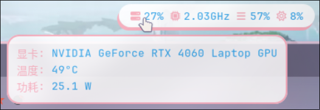 |
| `CPU 监控` | 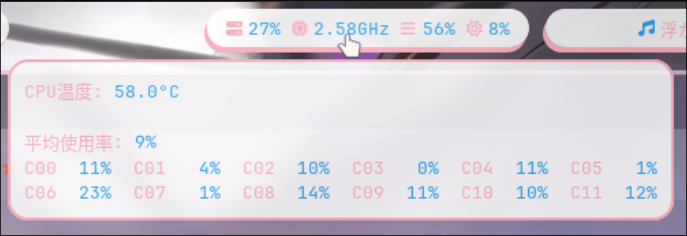 |
| `内存监控` | 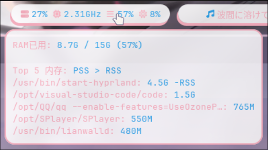 |
| `媒体信息` <br> `音频流可视化` | 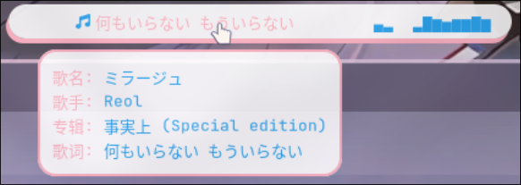 |
| `右侧岛屿` <br> 网络 / 音量 / 电池 / 蓝牙 …） |  |
| `网络信息` | 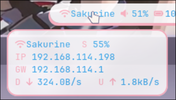 |
| `蓝牙信息` | 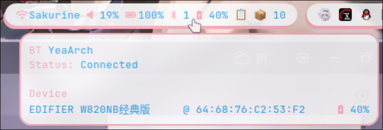 |
| `包管理器` | 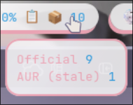 |
| `系统托盘` |  |
| `托盘右键菜单样式` | 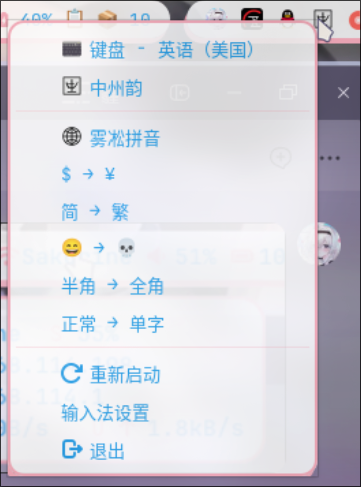 |


#### 因为我的配置比较复杂, 所以特意放到最后来说

在这里我会将每一个模块拆解开, 为你介绍他的功能, 依赖, 脚本, 以及脚本的用法

##### 当前工作区显示 ws_current

##### 所有工作区状态 workspaces

##### 图标 arch_logo

##### 当前活动窗口监控 window

##### 时间和日期显示 clock

##### 显卡监控 gpuinfo

##### cpu监控 cpu

##### 内存与swap监控 memory

##### 媒体显示器 media

##### 音频可视化 cava

##### 网络模块 network

##### 音频控制 pulseaudio

##### 电池信息 battery

##### 蓝牙模块 bluetooth

##### 剪贴板 clipboard

##### 系统更新 updates

##### 系统托盘 tray

##### (未启用) backlight
