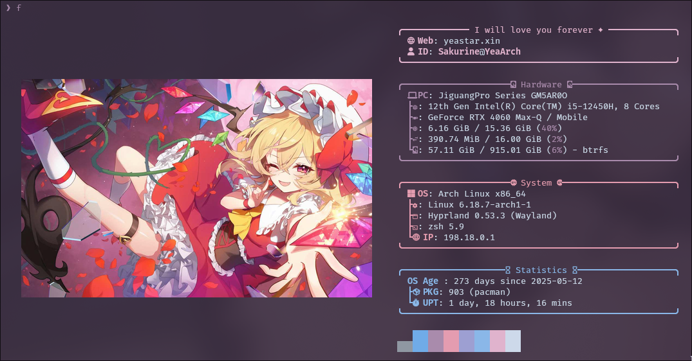
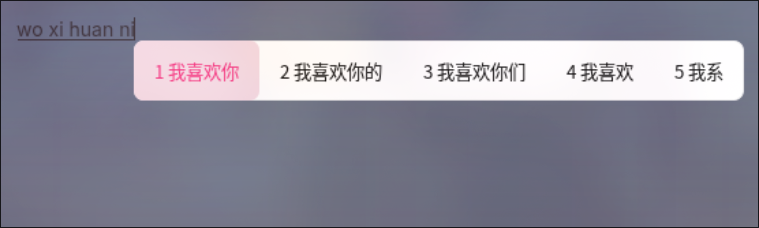
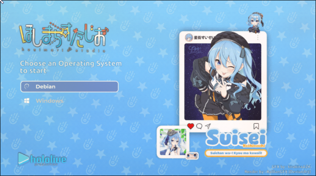
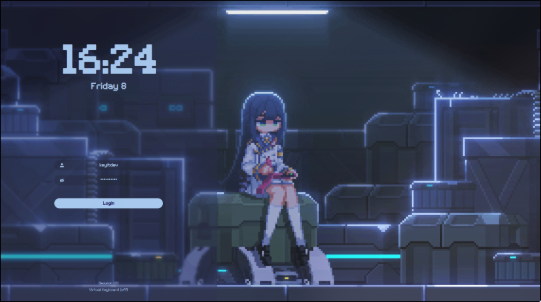
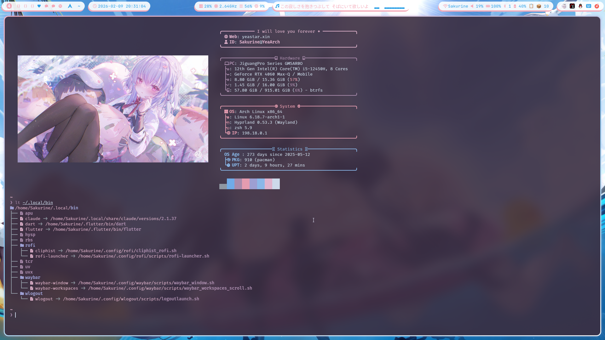
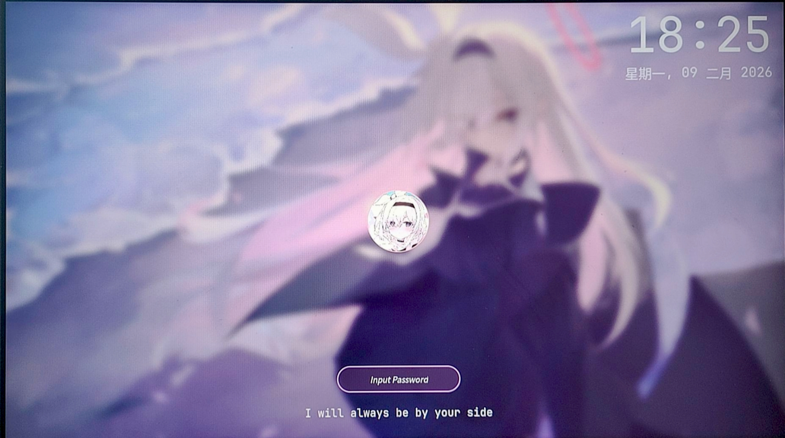
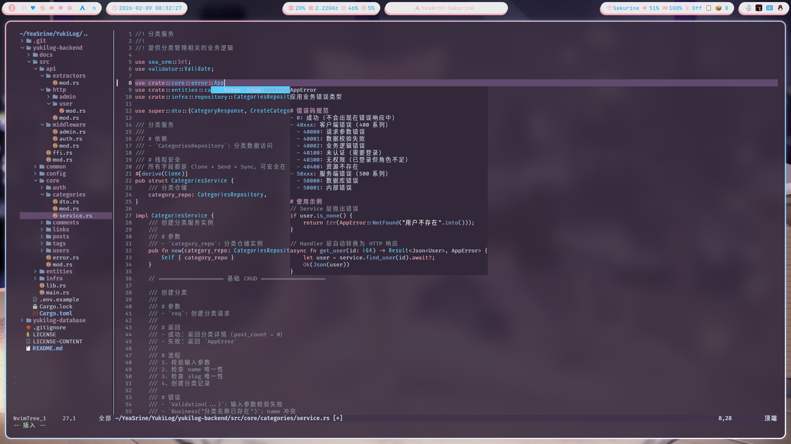
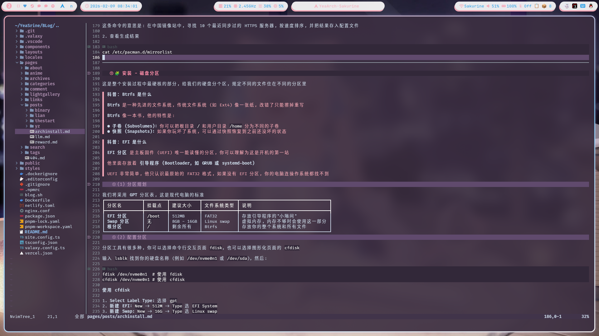

<div align="center">

# 恋的 Arch 配置

> 我使用的桌面环境是 `Hyprland` + `Wayland` + `quickshell` + `kitty` + `zsh`

哎呀, 我自己都懒得更新README了...叫AI帮忙写了一版出来, 如果你对配置有疑问就直接来加联系方式问我吧! 我会一步一步带着你做的!


**执行任何命令之前, 请确保你了解他在做什么!!!**

---

## 关于这个仓库

这个仓库本质上是 **我自己用的 dotfiles 备份**，不是为了让任何人都能开箱即用而发布的

我的环境里有大量自己编写的脚本、自己写的小软件 (`lian` / `lianwall` / `hysp` / `stalk_hypr` ...)，以及自己一套配置哲学 如果你对其中某一部分的配置感兴趣，**欢迎学习他的配置思路**，但不建议直接 copy 
配置是个人化的：抄别人的配色、抄别人的快捷键、抄别人的脚本，最后只会让你不知道为什么这台机器是这样运作的 

> 我希望你看完之后能写出自己的配置，而不是把这份仓库 clone 到 `~/.config` 直接用 

</div>

---

## 部署策略

> **核心思想：所有配置源文件都维护在 `~/.lian`，再分发软链到 `~/.config` 与 `~/.local/bin` **
>
> 这样做的好处：
> - 所有应用仍然按 XDG 规范从 `~/.config` 读取，**对应用透明** 
> - 整个仓库随时可以 `git diff` / `git log` 看出我做过什么改动 
> - 换机器只需要一次 `git clone` + 一次软链脚本 

我的桌面会话入口在 `hyprland.conf` 的 `exec-once` 中，服务部署策略如下：

- 🖥️ **必须继承 Wayland session 环境的 GUI 服务**（kanshi / polkit-gnome / mihomo-party / quickshell / lianwall 等）
  → 由 `exec-once` 直接拉起，确保 `WAYLAND_DISPLAY` / `HYPRLAND_INSTANCE_SIGNATURE` / IM 变量完整继承
- ⚙️ **跟随会话生命周期的常驻服务**（fcitx5 / cliphist-watch / hysp / stalk-hypr / tuxedo-tray / hypr-event-daemon）
  → 由 `hyprland-session.target` 统一管理的 `systemd --user` 服务（`exec-once` 只 import-environment 和 start 这一个 target）
- 🔧 还有少部分系统级服务（`sddm` / `bluetooth` / `polkit` / `wpa_supplicant`）需要在用户登录前启动，配置为 `systemctl enable` 

`exec-once` 中也负责导入环境变量到 user systemd（`dbus-update-activation-environment` + `systemctl --user import-environment`）、并启动 `hyprland-session.target` 

#### 目录（快速跳转）

| 模块 | 说明 |
|---|---|
| [fastfetch](#fastfetch) | 终端系统信息展示与脚本（开机 / 开终端美化）  |
| [fcitx5](#fcitx5) | 输入法框架 + Rime（含取消 Shift 切换中英）  |
| [GRUB](#grub) | 引导界面主题配置  |
| [sddm](#sddm) | 登录管理器 + astronaut 主题与登录问题修复  |
| [zsh](#zsh) | Shell 本体 + 常用插件与安装命令  |
| [starship](#starship) | 提示符配置（`starship.toml`）  |
| [kanshi](#kanshi) | 多显示器自动切换（笔记本 / 外接屏）  |
| [kitty](#kitty) | 终端模拟器配置与字体、splits 分屏、ssh 兼容说明  |
| [GTK](#gtk) | GTK 3/4 主题覆盖（配色由 matugen 动态生成）  |
| [Qt (qt6ct)](#qt6ct) | Qt 应用主题适配（palette 由 matugen 写入）  |
| [fontconfig](#fontconfig) | 中日韩字体回退顺序覆盖  |
| [mimeapps](#mimeapps) | XDG 默认应用关联  |
| [git/ignore](#gitignore) | 全局 gitignore（XDG 路径）  |
| [btop](#btop) | 终端系统监控配置  |
| [cava](#cava) | 音频频谱可视化（quickshell 媒体卡也读它）  |
| [hyprlock](#hyprlock) | 锁屏配置与字体依赖  |
| [Hyprland](#hyprland) | 窗口管理器 / 混成器核心配置说明  |
| [systemd/user](#systemduser) | Hyprland 用户会话服务管理  |
| [nvim](#nvim) | Neovim 配置结构、插件与依赖  |
| [quickshell](#quickshell) | 主线桌面外壳：Bar / 启动器 / 剪贴板 / 灵动岛 / 锁屏 全在这  |
| [matugen](#matugen) | 从当前壁纸生成 Material You palette 派发到 GTK / qt6ct / quickshell  |
| [lianwall](#lianwall) | 壁纸引擎与 hooks（含主题热更钩子）  |

---

## | fastfetch

这是一个在终端打印输出系统信息的包, 效果如下:



###### 你可以使用 `pacman` 进行安装:

```bash
sudo pacman -S fastfetch
```

我的配置目录如下:

```
 fastfetch
├──  config.jsonc              # 基本的样式配置
├──  logo                      # 存放 logo 图片的目录 (.gitignore 中, 个人化资源)
└──  scripts
    ├──  fastfetch-age.sh      # 系统使用时间（硬编码起始日期 2025-05-12, 自行修改）
    ├──  fastfetch-ip.sh       # 当前出网 IP
    └──  fastfetch-logo.sh     # 从 logo/ 随机抽一张图
```

* 如果你想用默认的 logo, 直接删除 `fastfetch/logo` 这一行 ascii 配置即可 
* `logo/` 在 `.gitignore` 里 —— 我机器上有个人收藏的图片，没有附进仓库 

## | fcitx5

`fcitx5` 是最出名的输入法框架, 我的配置里使用了 `rime` 输入引擎, 以及 `rime-ice` 雾凇拼音输入方案 

```bash
sudo pacman -S fcitx5 fcitx5-configtool fcitx5-gtk fcitx5-qt fcitx5-rime
paru -S rime-ice-git
```

##### 必须的环境变量（systemd `environment.d`）

如果你发现 `fcitx5` 已经启动, 但 GTK / Qt / SDL / GLFW 程序里仍然没法正常输入, 通常就是缺少输入法环境变量 

我把这组变量放在本仓库的 [environment.d/10-input.conf](environment.d/10-input.conf), 建议你软链回系统目录:

```bash
mkdir -p ~/.config/environment.d
ln -sf ~/.lian/environment.d/10-input.conf ~/.config/environment.d/10-input.conf
```

> 这个目录会在 “用户级 systemd” 启动时读取, 所以你需要 **重新登录**（或重启）后环境变量才会生效 

仓库里 [fcitx5/rime/default.custom.yaml](fcitx5/rime/default.custom.yaml) 只有一个目的: **取消 `rime` 默认的 `Shift` 切换中英文** 

部署:

```bash
ln -sf ~/.lian/fcitx5/rime/default.custom.yaml ~/.local/share/fcitx5/rime/default.custom.yaml
```

##### 我推荐你直接使用 `fcitx5` 级别的中英切换

输入 `fcitx5-configtool` 打开图形化配置页面（或自己编辑配置文件）:

1. 确保 **当前输入法列表** 中包含: `键盘 - 英语 (美国)` 和 `中州韵 (Rime)`
2. 在 **全局选项** 里, 配置 切换输入法 的快捷键

##### 关于 `fcitx5` 主题

我使用的主题是 [ayaya](https://github.com/witt-bit/fcitx5-theme-ayaya), 这里不做详细教学 



## | GRUB

我的 `GRUB` 只做了主题配置, 用的是 [suiGRUB](https://www.gnome-look.org/p/2219756) 



## | sddm

`sddm` 是一款基于 `QML` 的显示管理器 

###### 使用 `pacman` 安装并设置开机自启

```bash
sudo pacman -S sddm
sudo systemctl enable sddm
```

##### 我使用的主题是 [sddm-astronaut-theme](https://github.com/Keyitdev/sddm-astronaut-theme/)

我用的是其中的 `hyprland_kath` 主题, 因为嫌其他主题太冗余, 直接删掉了 



部署：

```bash
sudo cp -r ~/.lian/sddm/themes/sddm-astronaut-theme /usr/share/sddm/themes/
```

然后编辑 `/etc/sddm.conf`:

```ini
[Theme]
    Current=sddm-astronaut-theme
```

##### 无法登录问题

如果你也使用 `sddm-astronaut-theme`, 可能遇到一个登录问题: **用户名显示全大写, 而实际用户名包含大小写** 

这个问题在 [issues #58](https://github.com/Keyitdev/sddm-astronaut-theme/issues/58) 中提及, 需要修改对应主题的 `conf` 文件:

```ini
AllowUppercaseLettersInUsernames="false"
```

## | zsh

`zsh` 是一款强大的 shell 程序 

我的配置主要由三部分组成：

- 一些更顺手的命令行工具（`eza` / `bat` / `dust` / `fastfetch`）
- 提示符与目录跳转（`starship` / `zoxide`）
- zsh 插件与补全（`zsh-completions` / `zsh-autosuggestions` / `zsh-syntax-highlighting`）

###### 安装（Arch Linux）

```bash
sudo pacman -S --needed \
    zsh \
    starship zoxide \
    eza bat dust fastfetch \
    zsh-completions zsh-autosuggestions zsh-syntax-highlighting
```

> - 我在 `.zshrc` 里是从 `/usr/share/zsh/plugins/...` 读取插件的，所以你需要安装上面这三个 `zsh-*` 包 
> - `fastfetch` 负责我每次打开终端自动展示系统信息（`.zshrc` 最后有一行 `f`） 

##### 启用 zsh

```bash
chsh -s /bin/zsh
```

##### 部署 .zshrc

```bash
ln -sf ~/.lian/.zshrc ~/.zshrc
mkdir -p ~/.config/zsh   # 历史文件目录, .zshrc 里指向 ~/.config/zsh/zsh_history
```

##### 关键点

- 历史记录写入到 `~/.config/zsh/zsh_history`
- 别名:
  - `ls` → `eza`（带图标、git 状态）
  - `cat` → `bat`
  - `du` → `dust`
  - `f` → `fastfetch`
- 增强:
  - `compinit` + `zsh-completions` 补全
  - `zsh-autosuggestions` 自动建议
  - `zsh-syntax-highlighting` 语法高亮
- 体验:
  - `starship` 提示符
  - `zoxide` 目录跳转（我把 `cd` alias 成了 `z`，以及 `cdi` → `zi`）

## | starship

[starship](https://starship.rs/) 是一款跨 shell 的提示符 我的配置在仓库根 [starship.toml](starship.toml) 

部署：

```bash
ln -sf ~/.lian/starship.toml ~/.config/starship.toml
```

如果你已经有自己的 `starship.toml`，建议先 diff 再决定是否覆盖 我的配置里改了字符样式、颜色、模块顺序，并不通用 

## | kanshi

如果你有多个显示器，用它来管理是个很不错的方案 

###### 使用 `pacman` 进行安装

```bash
sudo pacman -S kanshi
```

我推荐直接在 `~/.config/hypr/hyprland.conf` 中加入 `exec-once = kanshi` 来启动它（仓库已经这么写了） 

我的配置文件只有一个：

```ini
profile {
    output eDP-1 enable mode 2560x1440@165 position 0,0
}

profile {
    output eDP-1 disable
    output HDMI-A-1 enable mode 1920x1080@180 position 0,0
}
```

我有笔记本显示器 `eDP-1` 和外接显示器 `HDMI-A-1`，策略是 **有外接显示器时笔记本就熄屏** 

## | kitty

`kitty` 是一个支持真彩色、光标拖尾、更强控制序列的终端 



###### 使用 `pacman` 安装

```bash
sudo pacman -S kitty
```

我使用 `kitty-theme` 挑选了自己喜欢的主题，然后自己配置了字体、光标拖尾 

```
 kitty
├── 󱁻 current-theme.conf       # 终端主题（kitty-theme 管理，不要手动改）
├── 󱁻 dark-theme.auto.conf      # 暗色主题备份
└── 󱁻 kitty.conf               # 主配置文件
```

如果你想要安装我的字体：

```bash
sudo pacman -S ttf-fira-code
```

这是一款非常适合编程的字体，支持连字 

##### 配置要点

| 项目 | 值 | 说明 |
|---|---|---|
| 字体 | `Fira Code 10` | 连字开启 (`disable_ligatures never`) |
| 光标 | block + 拖尾 | `cursor_trail 3`，带衰减动画 |
| 透明度 | `0.9`（动态可调） | `dynamic_background_opacity yes` |
| 行内边距 | `12px` | `window_padding_width 12` |
| 高刷同步 | `repaint_delay 8` / `input_delay 2` | 针对 165Hz/180Hz 屏优化 |

##### 分屏 (Splits)

kitty 原生支持在同一窗口内分割多个 shell，无需额外软件 

| 快捷键 | 动作 |
|---|---|
| `Ctrl+Shift+Enter` | 上下分（水平切割） |
| `Ctrl+Shift+\` | 左右分（垂直切割） |
| `Ctrl+Shift+↑/↓/←/→` | 焦点移动 |
| `Ctrl+Alt+↑/↓/←/→` | 调整分屏大小 |
| `Ctrl+Alt+R` | 大小复原 |
| `Ctrl+Shift+Z` | 最大化/还原当前分屏 |
| `Ctrl+Shift+W` | 关闭当前分屏 |

##### 使用 `kitty` 进行 ssh 连接

`kitty` 拥有自己专属的终端类型 `xterm-kitty` 直接 ssh 服务器大概率会报 `WARNING: terminal is not fully functional` / `'xterm-kitty': unknown terminal type` 

`kitty` 官方推荐的解决方案是：

```bash
kitty +kitten ssh 用户@地址
```

它会自动把 terminfo 安装到远端 

## | GTK

如果你抄完本仓库后发现 GTK 应用（`nautilus` / `pavucontrol` 等）的窗口配色、字体、光标风格和我的截图不一致，通常就是你本机缺少 `~/.config/gtk-3.0/` 与 `~/.config/gtk-4.0/` 的覆盖配置 

本仓库提供了：

- [gtk-3.0/settings.ini](gtk-3.0/settings.ini) + [gtk-3.0/gtk.css](gtk-3.0/gtk.css)
- [gtk-4.0/settings.ini](gtk-4.0/settings.ini) + [gtk-4.0/gtk.css](gtk-4.0/gtk.css)

部署：

```bash
ln -sf ~/.lian/gtk-3.0 ~/.config/gtk-3.0
ln -sf ~/.lian/gtk-4.0 ~/.config/gtk-4.0
```

> - 我的 `settings.ini` 里仍然使用 `Adwaita` 作为 GTK 主题/图标主题 
> - 光标主题设置成了 `BreezeX-RosePineDawn-Linux`；你如果没装对应光标主题，会回退成系统默认光标 

## | Qt (qt6ct)

为了让 Qt 应用（特别是 KDE 全家桶之外的 Qt 程序）也能跟随我设定的主题、图标、字体，我用 [qt6ct](https://archlinux.org/packages/?name=qt6ct) 做统一覆盖 

```bash
sudo pacman -S --needed qt6ct
```

部署：

```bash
ln -sf ~/.lian/qt6ct/qt6ct.conf ~/.config/qt6ct/qt6ct.conf
```

让 Qt 真正读取 qt6ct 的设置，需要在环境变量里声明：

```bash
QT_QPA_PLATFORMTHEME=qt6ct
```

我已经写在 [environment.d/10-input.conf](environment.d/10-input.conf) 里了 —— 同一份 environment.d 顺手把这个变量也带上了 

## | fontconfig

[fontconfig/conf.d/64-language-selector-prefer.conf](fontconfig/conf.d/64-language-selector-prefer.conf) 是我针对中文/日文/韩文显示偏好做的字体回退顺序覆盖 

```bash
ln -sf ~/.lian/fontconfig/conf.d/64-language-selector-prefer.conf \
       ~/.config/fontconfig/conf.d/64-language-selector-prefer.conf
fc-cache -fv
```

如果你跟我的字体偏好不同（比如更喜欢 `Noto Sans CJK SC` 而不是我的 fallback 顺序），改这个文件即可 

## | mimeapps

[mimeapps.list](mimeapps.list) 是 XDG 标准的“默认应用关联”表，决定 `xdg-open` 默认用哪个程序打开 `text/plain` / `image/png` / `inode/directory` 等 

部署：

```bash
ln -sf ~/.lian/mimeapps.list ~/.config/mimeapps.list
```

> 我当前机器上的真实关联（节选自 [mimeapps.list](mimeapps.list)）：
> - 网页 / `http(s)` / `about:` → `google-chrome`
> - `clash://` / `mihomo://` → `mihomo-party`
> - `inode/directory` → `thunar`
> - `text/markdown` / `application/octet-stream` → `nvim`
> - `text/plain` / `application/x-shellscript` → `code`（VS Code）
> - `claude-cli://` → `claude-code-url-handler`
>
> 跟你本机装的软件不一样的话需要改 

## | git/ignore

[git/ignore](git/ignore) 是我的全局 `.gitignore`，被 `~/.config/git/ignore` 引用 它只忽略一类东西：

```
**/.claude/settings.local.json
```

也就是 claude code 在我每个工作仓库里自动生成的本地设置（不应该 commit 到任何项目里） 

部署：

```bash
mkdir -p ~/.config/git
ln -sf ~/.lian/git/ignore ~/.config/git/ignore
```

## | btop

[btop](https://github.com/aristocratos/btop) 是一个很漂亮的终端系统监控 我的 `btop.conf` 主要改了主题、布局、刷新率 

```bash
sudo pacman -S btop
ln -sf ~/.lian/btop/btop.conf ~/.config/btop/btop.conf
```

## | cava

`cava` 是音频频谱可视化工具 我用它做主程序播放可视化（终端里直接跑），quickshell 媒体卡也会从同一份配置取数据 

```bash
sudo pacman -S cava
mkdir -p ~/.config/cava
ln -sf ~/.lian/cava/config ~/.config/cava/config
```

> `~/.config/cava/` 目录下还有 cava 自带的 shaders/themes，所以只软链 `config`，不要整目录软链 

## | hyprlock

`hyprlock` 是一个简单的锁屏软件 



###### 使用 `pacman` 安装

```bash
sudo pacman -S hyprlock
```

如果你想要获得和我一样的效果, 还需要安装这个字体:

```bash
sudo pacman -S ttf-jetbrains-mono-nerd
```

## | Hyprland

本次配置的重头戏之一 `hyprland` 是我心目中最 **linux** 的桌面环境 

###### 使用 `pacman` 安装（可能会漏掉一些包，请以 hypr.land 为准）

```bash
sudo pacman -S hyprland xdg-desktop-portal-hyprland xdg-desktop-portal-gtk \
              qt5-wayland qt6-wayland polkit-gnome
```

* `hyprland`: 混成器，充当窗口管理器，也是显示服务器
* `xdg-desktop-portal-hyprland`: Hyprland 与应用沟通的桥梁
* `xdg-desktop-portal-gtk`: 提供文件选择对话框
* `qt5/6-wayland`: 让基于 qt 框架的应用能跑在 wayland 上
* `polkit-gnome`: 当你执行需要 sudo 权限的 gui 应用时跳出弹窗

关于 `hyprland` 配置详解, 可以直接 [跳转](./hypr/hyprland.conf) 查看注释, 但这里还是做一个简单介绍：

* **修复区:** 一些杂项修复
* **窗口规则:** 定义窗口弹出时的行为，例如浮动模式、弹出大小……
* **NVIDIA:** N 卡修复（如果你刚开始觉得渲染网页/调度 GPU 卡顿是正常的，几天后还卡顿那就不正常了 :)）
* **QT 变量:** 让 QT 高效运行在 wayland 高分屏
* **全局变量:** hyprland 配置文件支持变量，建议把常用目录全部定义为变量
* **自动启动:** 跟随 hyprland 启动的软件
* **窗口外观:** 圆角、边框、颜色、动画……
* **快捷键:** 这部分建议直接抄作业

你可以直接把配置文件丢给 AI 问，如果有一些软件 AI 不认识（比如 `lianwall` `hysp`），那是正常的——这些是我自己写的软件，在我的 [Github](https://github.com/Yueosa) 主页可以找到 

#### 桌面快捷键（与 quickshell 协作）

桌面 Bar / 启动器 / 剪贴板 / 灵动岛 / 通知中心 / 侧边栏全部由 [quickshell](#quickshell) 提供，Hyprland 只负责把按键转成 IPC 调用：

| 快捷键 | 动作 |
|---|---|
| `SUPER + A` | 应用启动器：`qs ipc call launcher toggle` |
| `ALT  + TAB` | 灵动岛 Hub（Overview）：`qs ipc call island hub` |
| `SUPER + TAB` | 灵动岛 Switcher（窗口）：`qs ipc call island switcher` |
| `SUPER + Z` | 剪贴板：`qs ipc call clipboard toggle` |
| `ALT  + Z` | 侧边栏：`qs ipc call sidebar toggle` |
| `ALT  + SPACE` | 通知中心：`qs ipc call notif toggle` |
| `ALT  + N` / `ALT + S` | 壁纸 next / 模式切换：`lianwall next` / `lianwall switch` |
| `SUPER + SHIFT + ←/→/↓` | 工作区切换：`$window down/up/empty` |

完整定义见 [hypr/hyprland.conf](hypr/hyprland.conf) 

#### Scrolling 无限平铺布局（hyprland-git / 0.54+）

> **前置条件**：需要 `hyprland-git`（AUR）或正式版 0.54+ 
> 0.53.x 稳定版不含此功能；升级前建议先做 Timeshift 快照 

Scrolling 是 Hyprland 新增的一种布局模式，窗口排列在一条 **无限水平卷轴** 上，屏幕作为视口左右滚动浏览，类似 [niri](https://github.com/YaLTeR/niri) 的体验 

我的策略是 **保留 dwindle 为默认布局**，按快捷键随时切换，两种模式自由来回 

##### `scrolling` 块关键配置

| 选项 | 值 | 说明 |
|---|---|---|
| `column_width` | `0.8` | 切入 scrolling 时的默认列宽（屏幕 80%） |
| `follow_focus` | `true` | 焦点切换时视口自动跟随 |
| `follow_min_visible` | `0.4` | 目标窗口低于 40% 可见时才触发跟随 |
| `fullscreen_on_one_column` | `true` | 只剩一列时自动全屏 |

##### 快捷键

| 快捷键 | 功能 | 适用布局 |
|---|---|---|
| `SUPER + S` | 切换 dwindle ↔ scrolling（带通知） | 两者 |
| `SUPER + ←/→/↑/↓` | 焦点切换（scrolling 下左右会自动滚动视口） | 两者 |
| `SUPER + ALT + ←/→` | 把当前窗口移到左/右列 | scrolling |
| `SUPER + ALT + ↑/↓` | 在同列内上下移窗 | scrolling |
| `SUPER + 滚轮下/上` | 视口向右/左滚一列 | scrolling |
| `SUPER + 鼠标右键拖` | 调整列宽 | scrolling |

## | systemd/user

我的 Hyprland 会话里有不少需要长期运行的组件：`fcitx5`、`lianwall`、`cliphist`、`hysp`、`stalk-hypr`，以及 `hypr-event-daemon`、`tuxedo-tray` 

早期这些东西全写在 `hyprland.conf` 的 `exec-once` 里，配置直观，但排查启动失败、重登后的残留进程、异常退出后的恢复都不太方便 

现在的策略是：

- `hyprland.conf` 仍然作为桌面会话入口
- `exec-once` 只负责导入 Wayland/Hyprland 环境变量，并启动 `hyprland-session.target`
- 常驻组件放在 [systemd/user](systemd/user) 中，由 `systemd --user` 管理生命周期
- `~/.config/systemd/user/*.service|*.target` 只作为软链，源文件维护在 `~/.lian`

> Bar / 通知 / 启动器 / 剪贴板 等桌面外壳由 [quickshell](#quickshell) 单进程承担，**不**走 systemd unit 

会话入口在 [hypr/hyprland.conf](hypr/hyprland.conf)：

```ini
exec-once = dbus-update-activation-environment --systemd WAYLAND_DISPLAY XDG_CURRENT_DESKTOP XDG_SESSION_TYPE XDG_SESSION_DESKTOP HYPRLAND_INSTANCE_SIGNATURE DISPLAY
exec-once = systemctl --user import-environment WAYLAND_DISPLAY XDG_CURRENT_DESKTOP XDG_SESSION_TYPE XDG_SESSION_DESKTOP HYPRLAND_INSTANCE_SIGNATURE DISPLAY
exec-once = systemctl --user start hyprland-session.target
exec-shutdown = systemctl --user stop hyprland-session.target
```

##### 部署软链

```bash
mkdir -p ~/.config/systemd/user

ln -sf ~/.lian/systemd/user/*.service ~/.config/systemd/user/
ln -sf ~/.lian/systemd/user/*.target  ~/.config/systemd/user/

systemctl --user daemon-reload
systemctl --user enable \
    fcitx5.service \
    lianwall.service \
    cliphist-watch.service \
    stalk-hypr.service \
    hysp.service \
    tuxedo-tray.service \
    hypr-event-daemon.service
```

##### 各 service 简介

| 单元 | 作用 |
|---|---|
| `hyprland-session.target` | 把所有“跟随 Hyprland 会话”的服务挂到这个 target 下，登出时一起停 |
| `fcitx5.service` | 输入法 |
| `lianwall.service` | 我自己写的壁纸守护（在 [Github](https://github.com/Yueosa) 主页可以找到） |
| `cliphist-watch.service` | 后台监听 `wl-paste`，写入 cliphist 历史；quickshell 剪贴板从这里读 |
| `stalk-hypr.service` | 我自己写的 Hyprland 状态记录器 |
| `hysp.service` | 我自己写的小工具 |
| `tuxedo-tray.service` | TUXEDO 笔记本控制中心托盘 |
| `hypr-event-daemon.service` | 监听 Hyprland `.socket2.sock` 事件，把 active window/workspace 写到缓存 |

##### 管理命令

```bash
systemctl --user status hyprland-session.target
systemctl --user status fcitx5 lianwall hypr-event-daemon
systemctl --user restart fcitx5
journalctl --user -u lianwall -b
```

`hyprland-session.target.wants/` 这类目录不需要手动维护；它们是 `systemctl --user enable` 之后生成的本机状态 

## | nvim

`nvim` 是一款比 `vim` 更强的文本编辑器，我目前对它进行了 `rust` 和 `markdown` 的定制化 

| rust 开发体验 | markdown 体验 |
|-|-|
|  |  |

###### 使用 `pacman` 安装

```bash
sudo pacman -S neovim
```

部署：

```bash
ln -sf ~/.lian/nvim ~/.config/nvim
```

如果你已经有自己的 nvim 配置，可以只参考 `lua/` 里的模块结构 

##### 目录结构

```
 nvim
├──  init.lua
├──  lazy-lock.json
├──  lua
│   ├──  core
│   │   ├──  options.lua      # 基础选项（缩进/行号/分屏方向 ...）
│   │   ├──  autocmds.lua     # 全局自动命令
│   │   └──  keymaps.lua      # 全局快捷键（K / <leader>f* / 诊断跳转）
│   └──  plugins
│       ├──  init.lua         # lazy.nvim 引导 + 聚合 specs
│       └──  specs            # 每类插件一个文件
│           ├──  ui.lua          # nvim-tree + render-markdown
│           ├──  lsp.lua         # lspconfig + mason + mason-lspconfig
│           ├──  cmp.lua         # nvim-cmp + LuaSnip + cmp-nvim-lsp/buffer/path
│           ├──  treesitter.lua  # nvim-treesitter（自动装 parser）
│           ├──  rust.lua        # rustaceanvim
│           ├──  telescope.lua
│           ├──  whichkey.lua
│           ├──  comment.lua
│           ├──  autopairs.lua
│           ├──  git.lua         # vim-fugitive + gitsigns
│           └──  venv.lua        # python venv 选择器
└──  sakurine                 # 我自己写的主题（colorscheme），不是第三方主题包
    ├──  autoload
    └──  colors
```

##### 插件清单

我使用 [lazy.nvim](https://github.com/folke/lazy.nvim) 管理插件（`init.lua` 自举克隆） 当前实际启用的插件：

| 模块 | 插件 |
|---|---|
| 文件树 / Markdown | `nvim-tree.lua`、`render-markdown.nvim` |
| LSP | `nvim-lspconfig` + `mason.nvim` + `mason-lspconfig.nvim`（默认装 `lua_ls` / `pyright` / `vtsls`） |
| 补全 | `nvim-cmp` + `LuaSnip` + `cmp-nvim-lsp` / `cmp-buffer` / `cmp-path` / `cmp_luasnip` |
| 语法 | `nvim-treesitter`（rust/lua/python/c/asm/dart/html/css/js/ts/vue/json/toml/sql/markdown 等） |
| Rust | `rustaceanvim`（直接接管 rust-analyzer，不走 lspconfig） |
| 模糊搜索 | `telescope.nvim` |
| Git | `vim-fugitive`、`gitsigns.nvim` |
| 体验 | `which-key.nvim`、`comment.nvim`、`nvim-autopairs` |
| Python | venv 选择器 |

系统依赖：

```bash
sudo pacman -S --needed neovim git curl tree-sitter-cli
```

> - `tree-sitter-cli` 用于 `nvim-treesitter` 自动安装/更新解析器；缺它启动时会 WARN 但不报错 
> - LSP server 由 `mason.nvim` 在 nvim 内部管理（`:Mason`），不需要 pacman 装 

##### 常用快捷键

> `<leader>` = 空格键（Space） 

| 键 | 功能 |
|---|---|
| `<leader>w` | 切换文件树（nvim-tree） |
| `<leader>e` | 在「文件树 / 编辑区」之间切焦点 |
| 文件树里 `v` | 竖分屏打开选中文件 |
| `<leader>ff` / `fg` / `fb` / `fh` | Telescope：文件 / 文本 / Buffer / 帮助 |
| `<leader>dd` / `]d` / `[d` | 诊断详情 / 下一处 / 上一处 |
| `<leader>ca` | 代码操作（rust 内由 rustaceanvim 接管） |
| `K` | 悬停文档（带圆角 border） |

忘了的话直接按 `Space` 等 `which-key` 弹出提示即可 

---

## | quickshell

[quickshell](https://quickshell.outfoxxed.me/) 是基于 Qt6/QML 的 Wayland 桌面外壳框架

- 顶部 Bar / 灵动岛（含 Hub / Switcher / Overview / 媒体 / 天气）
- 应用启动器、剪贴板、通知中心、侧边栏
- 锁屏（hyprlock 之外的应用层补充）
- 与 [matugen](#matugen) 联动，主题色随壁纸切换实时更新

###### 安装依赖

```bash
paru -S quickshell-git
sudo pacman -S --needed qt6-base qt6-declarative qt6-wayland qt6-svg
```

###### 部署

```bash
ln -sf ~/.lian/quickshell ~/.config/quickshell
```

###### 启动方式

由 `hyprland.conf` 的 `exec-once = qs` 拉起；不走 systemd user unit（quickshell 本身具备崩溃自恢复，且需要直接持有 Wayland 环境变量） 

###### 与外部脚本/快捷键的契约

所有桌面快捷键通过 `qs ipc call <module> <action>` 调用，定义在 [Hyprland](#hyprland) 节的快捷键表里 

> 实现细节、模块拆分、IPC 协议见 [quickshell/README.md](quickshell/README.md) 

## | matugen

[matugen](https://github.com/InioX/matugen) 是一个 Rust 写的 Material You 配色生成器：输入图片，输出多套模板渲染结果 

我用它把当前壁纸的主色调实时派发到 GTK3 / GTK4 / qt6ct，再由 quickshell 自己读 palette 做内部颜色刷新 

###### 安装

```bash
paru -S matugen
```

###### 配置

[matugen/config.toml](matugen/config.toml) 定义了三套模板：

| 模板 | 输入（仓库内模板） | 输出（被消费的位置） |
|---|---|---|
| GTK3 | `matugen/templates/gtk-3.0/gtk.css` | `gtk-3.0/gtk.css`（仓库 → 软链 → `~/.config/gtk-3.0/`，被 gitignore） |
| GTK4 | `matugen/templates/gtk-4.0/gtk.css` | `gtk-4.0/gtk.css`（同上） |
| qt6ct | `matugen/templates/qt6ct/colors.conf` | `~/.config/qt6ct/colors/MatugenAuto.conf`（运行时产物，不入库） |

> **被忽略的产物**：`gtk-3.0/gtk.css` 和 `gtk-4.0/gtk.css` 在 [.gitignore](.gitignore) 中精确指定为忽略，避免主题切换的 diff 污染仓库 **模板**（`matugen/templates/...`）正常入库 

###### 触发方式

由 [lianwall](#lianwall) 的 `quickshell-theme-refresh` hook 在每次壁纸切换后调用 [quickshell/scripts/update_theme_from_wallpaper.sh](quickshell/scripts/update_theme_from_wallpaper.sh)，里面会跑：

```bash
matugen image "$WALLPAPER" --source-color-index 0 --mode <auto|dark|light> --json hex --old-json-output
```

然后把 JSON 喂给 quickshell（quickshell 内部 `Colorscheme.qml` 监听文件变化做热更） 

## | lianwall

`lianwall` 是我自己写的壁纸引擎（守护进程 + CLI），支持视频/图片混合、定时切换、模式切换、VRAM 自适应降级等 详见 [Github](https://github.com/Yueosa) 

仓库里只纳管 [lianwall/hooks.toml](lianwall/hooks.toml) —— 这是 daemon 的 hook 配置，**主题热更链路的关键**：

| hook 名 | 触发 | 作用 |
|---|---|---|
| `quickshell-theme-refresh` | `wallpaper_changed` | 调 `update_theme_from_wallpaper.sh` → matugen → 派发到 GTK/qt6ct/quickshell |
| 通知 / 缓存软链 / btop 弹窗 | 各种 | 见 hooks.toml 内注释 |

###### 部署

```bash
mkdir -p ~/.config/lianwall
ln -sf ~/.lian/lianwall/hooks.toml ~/.config/lianwall/hooks.toml
lianwall hook reload   # 不重启 daemon 重载 hooks
```

> `~/.config/lianwall/{config.toml, gui.conf}` 暂未纳管（用户私有，按需自己维护） 
