<div align="center">

# 恋的 Arch 配置

> 我使用的桌面环境是 `Hyprland` + `Wayland` + `kitty` + `zsh`


**执行任何命令之前, 请确保你了解他在做什么!!!**

---

## 关于这个仓库

这个仓库本质上是 **我自己用的 dotfiles 备份**，不是为了让任何人都能开箱即用而发布的。

我的环境里有大量自己编写的脚本、自己写的小软件 (`lian` / `lianwall` / `hysp` / `stalk_hypr` ...)，以及自己一套配置哲学。如果你对其中某一部分的配置感兴趣，**欢迎学习他的配置思路**，但不建议直接 copy。
配置是个人化的：抄别人的配色、抄别人的快捷键、抄别人的脚本，最后只会让你不知道为什么这台机器是这样运作的。

> 我希望你看完之后能写出自己的配置，而不是把这份仓库 clone 到 `~/.config` 直接用。

</div>

---

## 部署策略

> **核心思想：所有配置源文件都维护在 `~/.lian`，再分发软链到 `~/.config` 与 `~/.local/bin`。**
>
> 这样做的好处：
> - 所有应用仍然按 XDG 规范从 `~/.config` 读取，**对应用透明**。
> - 整个仓库随时可以 `git diff` / `git log` 看出我做过什么改动。
> - 换机器只需要一次 `git clone` + 一次软链脚本。

克隆我的仓库到 `$HOME/.lian` 下：

```bash
git clone git@github.com:Yueosa/.lian.git ~/.lian
# 或 HTTPS
git clone https://github.com/Yueosa/.lian.git ~/.lian
```

我的桌面会话入口在 `hyprland.conf` 的 `exec-once` 中，服务部署策略如下：

- 🖥️ **必须继承 Wayland session 环境的 GUI 服务**（kanshi / polkit-gnome / mihomo-party 等）
  → 由 `exec-once` 直接拉起，确保 `WAYLAND_DISPLAY` / `HYPRLAND_INSTANCE_SIGNATURE` / IM 变量完整继承
- ⚙️ **跟随会话生命周期的常驻服务**（waybar / swaync / fcitx5 / lianwall / cliphist-watch / hysp / stalk-hypr / tuxedo-tray / hypr-event-daemon）
  → 由 `hyprland-session.target` 统一管理的 `systemd --user` 服务（`exec-once` 只 import-environment 和 start 这一个 target）
- ⏰ **定时采集**（`lian-updates.timer`）
  → 由 `systemd --user timer` 拉起，写缓存 + 给 waybar 发信号
- 🔧 还有少部分系统级服务（`sddm` / `bluetooth` / `polkit` / `wpa_supplicant`）需要在用户登录前启动，配置为 `systemctl enable`。

`exec-once` 中也负责导入环境变量到 user systemd（`dbus-update-activation-environment` + `systemctl --user import-environment`）、并启动 `hyprland-session.target`。

#### 软链布局速查

下面这三段是我当前机器上最终的软链状态，你可以当成目标形态对照：

```bash
 ~/.local/bin/
├──  rofi
│   ├── 󰡯 cliphist        -> $HOME/.lian/rofi/cliphist_rofi.sh
│   └── 󰡯 rofi-launcher   -> $HOME/.lian/rofi/scripts/rofi-launcher.sh
├──  waybar
│   ├── 󰡯 waybar-window     -> $HOME/.lian/waybar/scripts/waybar_window.sh
│   ├── 󰡯 lbar              -> $HOME/.lian/waybar/lbar
│   └── 󰡯 waybar-workspaces -> $HOME/.lian/waybar/scripts/waybar_workspaces_scroll.sh
└──  wlogout
    └── 󰡯 wlogout          -> $HOME/.lian/wlogout/scripts/logoutlaunch.sh
```

```bash
 ~/.config/
├──  environment.d                          -> $HOME/.lian/environment.d
├──  fastfetch                              -> $HOME/.lian/fastfetch
├──  fontconfig/conf.d/64-language-…        -> $HOME/.lian/fontconfig/conf.d/64-…
├──  git/ignore                             -> $HOME/.lian/git/ignore
├──  gtk-3.0                                -> $HOME/.lian/gtk-3.0
├──  gtk-4.0                                -> $HOME/.lian/gtk-4.0
├──  hypr                                   -> $HOME/.lian/hypr
├──  kanshi                                 -> $HOME/.lian/kanshi
├──  kitty                                  -> $HOME/.lian/kitty
├──  nvim                                   -> $HOME/.lian/nvim
├──  rofi                                   -> $HOME/.lian/rofi
├──  swaync                                 -> $HOME/.lian/swaync
├──  waybar                                 -> $HOME/.lian/waybar
├──  wlogout                                -> $HOME/.lian/wlogout
├──  starship.toml                          -> $HOME/.lian/starship.toml
├──  mimeapps.list                          -> $HOME/.lian/mimeapps.list
├──  btop/btop.conf                         -> $HOME/.lian/btop/btop.conf
├──  cava/config                            -> $HOME/.lian/cava/config
├──  cava/config_waybar                     -> $HOME/.lian/cava/config_waybar
└──  qt6ct/qt6ct.conf                       -> $HOME/.lian/qt6ct/qt6ct.conf
```

> 注：`btop/`、`cava/`、`qt6ct/`、`fontconfig/conf.d/` 这几个目录在 `~/.config/` 下仍是 **真实目录**，只把目录里的 “由我维护的那一两个文件” 软链回仓库。这是因为这些应用还会在同名目录里写 themes / shaders / 字体缓存等运行时数据，整目录软链反而麻烦。

```bash
 ~/.config/systemd/user/
├── 󱆃 hyprland-session.target  -> $HOME/.lian/systemd/user/hyprland-session.target
├── 󱆃 waybar-lbar.service      -> $HOME/.lian/systemd/user/waybar-lbar.service
├── 󱆃 swaync.service           -> $HOME/.lian/systemd/user/swaync.service
├── 󱆃 fcitx5.service           -> $HOME/.lian/systemd/user/fcitx5.service
├── 󱆃 lianwall.service         -> $HOME/.lian/systemd/user/lianwall.service
├── 󱆃 cliphist-watch.service   -> $HOME/.lian/systemd/user/cliphist-watch.service
├── 󱆃 stalk-hypr.service       -> $HOME/.lian/systemd/user/stalk-hypr.service
├── 󱆃 hysp.service             -> $HOME/.lian/systemd/user/hysp.service
├── 󱆃 tuxedo-tray.service      -> $HOME/.lian/systemd/user/tuxedo-tray.service
├── 󱆃 hypr-event-daemon.service-> $HOME/.lian/systemd/user/hypr-event-daemon.service
├── 󱆃 lian-updates.service     -> $HOME/.lian/systemd/user/lian-updates.service
└── 󱆃 lian-updates.timer       -> $HOME/.lian/systemd/user/lian-updates.timer
```

> `*.wants/` 目录是 `systemctl --user enable ...` 生成的启用状态，不作为仓库源文件维护。

```bash
 ~/
└── 󱆃 .zshrc -> $HOME/.lian/.zshrc
```

#### 目录（快速跳转）

| 模块 | 说明 |
|---|---|
| [fastfetch](#fastfetch) | 终端系统信息展示与脚本（开机 / 开终端美化）。 |
| [fcitx5](#fcitx5) | 输入法框架 + Rime（含取消 Shift 切换中英）。 |
| [GRUB](#grub) | 引导界面主题配置。 |
| [sddm](#sddm) | 登录管理器 + astronaut 主题与登录问题修复。 |
| [zsh](#zsh) | Shell 本体 + 常用插件与安装命令。 |
| [starship](#starship) | 提示符配置（`starship.toml`）。 |
| [kanshi](#kanshi) | 多显示器自动切换（笔记本 / 外接屏）。 |
| [kitty](#kitty) | 终端模拟器配置与字体、splits 分屏、ssh 兼容说明。 |
| [gsimplecal](#gsimplecal) | 极简日历弹窗（waybar 时钟左键触发）。 |
| [GTK](#gtk) | GTK 3/4 主题覆盖。 |
| [Qt (qt6ct)](#qt6ct) | Qt 应用主题适配。 |
| [fontconfig](#fontconfig) | 中日韩字体回退顺序覆盖。 |
| [mimeapps](#mimeapps) | XDG 默认应用关联。 |
| [git/ignore](#gitignore) | 全局 gitignore（XDG 路径）。 |
| [btop](#btop) | 终端系统监控配置。 |
| [cava](#cava) | 音频频谱可视化（主程序 + waybar 嵌入）。 |
| [rofi](#rofi) | 应用启动器 / 窗口切换 / 剪贴板菜单与脚本。 |
| [swaync](#swaync) | 通知中心配置。 |
| [hyprlock](#hyprlock) | 锁屏配置与字体依赖。 |
| [wlogout](#wlogout) | 电源菜单（锁屏 / 登出 / 关机 / 重启）。 |
| [Hyprland](#hyprland) | 窗口管理器 / 混成器核心配置说明。 |
| [systemd/user](#systemduser) | Hyprland 用户会话服务管理。 |
| [nvim](#nvim) | Neovim 配置结构、插件与依赖。 |
| [waybar](#waybar) | 状态栏配置、模块预览与脚本拆解。 |

---

## | fastfetch

这是一个在终端打印输出系统信息的包, 效果如下:


###### 你可以使用 `pacman` 进行安装:

```bash
sudo pacman -S fastfetch
```

我的配置目录如下:

```
 fastfetch
├──  config.jsonc              # 基本的样式配置
├──  logo                      # 存放 logo 图片的目录 (.gitignore 中, 个人化资源)
└──  scripts
    ├──  fastfetch-age.sh      # 系统使用时间（硬编码起始日期 2025-05-12, 自行修改）
    ├──  fastfetch-ip.sh       # 当前出网 IP
    └──  fastfetch-logo.sh     # 从 logo/ 随机抽一张图
```

* 如果你想用默认的 logo, 直接删除 `fastfetch/logo` 这一行 ascii 配置即可。
* `logo/` 在 `.gitignore` 里 —— 我机器上有个人收藏的图片，没有附进仓库。

## | fcitx5

`fcitx5` 是最出名的输入法框架, 我的配置里使用了 `rime` 输入引擎, 以及 `rime-ice` 雾凇拼音输入方案。

```bash
sudo pacman -S fcitx5 fcitx5-configtool fcitx5-gtk fcitx5-qt fcitx5-rime
paru -S rime-ice-git
```

##### 必须的环境变量（systemd `environment.d`）

如果你发现 `fcitx5` 已经启动, 但 GTK / Qt / SDL / GLFW 程序里仍然没法正常输入, 通常就是缺少输入法环境变量。

我把这组变量放在本仓库的 [environment.d/10-input.conf](environment.d/10-input.conf), 建议你软链回系统目录:

```bash
mkdir -p ~/.config/environment.d
ln -sf ~/.lian/environment.d/10-input.conf ~/.config/environment.d/10-input.conf
```

> 这个目录会在 “用户级 systemd” 启动时读取, 所以你需要 **重新登录**（或重启）后环境变量才会生效。

仓库里 [fcitx5/rime/default.custom.yaml](fcitx5/rime/default.custom.yaml) 只有一个目的: **取消 `rime` 默认的 `Shift` 切换中英文**。

部署:

```bash
ln -sf ~/.lian/fcitx5/rime/default.custom.yaml ~/.local/share/fcitx5/rime/default.custom.yaml
```

##### 我推荐你直接使用 `fcitx5` 级别的中英切换

输入 `fcitx5-configtool` 打开图形化配置页面（或自己编辑配置文件）:

1. 确保 **当前输入法列表** 中包含: `键盘 - 英语 (美国)` 和 `中州韵 (Rime)`
2. 在 **全局选项** 里, 配置 切换输入法 的快捷键

##### 关于 `fcitx5` 主题

我使用的主题是 [ayaya](https://github.com/witt-bit/fcitx5-theme-ayaya), 这里不做详细教学。


## | GRUB

我的 `GRUB` 只做了主题配置, 用的是 [suiGRUB](https://www.gnome-look.org/p/2219756)。


## | sddm

`sddm` 是一款基于 `QML` 的显示管理器。

###### 使用 `pacman` 安装并设置开机自启

```bash
sudo pacman -S sddm
sudo systemctl enable sddm
```

##### 我使用的主题是 [sddm-astronaut-theme](https://github.com/Keyitdev/sddm-astronaut-theme/)

我用的是其中的 `hyprland_kath` 主题, 因为嫌其他主题太冗余, 直接删掉了。


部署：

```bash
sudo cp -r ~/.lian/sddm/themes/sddm-astronaut-theme /usr/share/sddm/themes/
```

然后编辑 `/etc/sddm.conf`:

```ini
[Theme]
    Current=sddm-astronaut-theme
```

##### 无法登录问题

如果你也使用 `sddm-astronaut-theme`, 可能遇到一个登录问题: **用户名显示全大写, 而实际用户名包含大小写**。

这个问题在 [issues #58](https://github.com/Keyitdev/sddm-astronaut-theme/issues/58) 中提及, 需要修改对应主题的 `conf` 文件:

```ini
AllowUppercaseLettersInUsernames="false"
```

## | zsh

`zsh` 是一款强大的 shell 程序。

我的配置主要由三部分组成：

- 一些更顺手的命令行工具（`eza` / `bat` / `dust` / `fastfetch`）
- 提示符与目录跳转（`starship` / `zoxide`）
- zsh 插件与补全（`zsh-completions` / `zsh-autosuggestions` / `zsh-syntax-highlighting`）

###### 安装（Arch Linux）

```bash
sudo pacman -S --needed \
    zsh \
    starship zoxide \
    eza bat dust fastfetch \
    zsh-completions zsh-autosuggestions zsh-syntax-highlighting
```

> - 我在 `.zshrc` 里是从 `/usr/share/zsh/plugins/...` 读取插件的，所以你需要安装上面这三个 `zsh-*` 包。
> - `fastfetch` 负责我每次打开终端自动展示系统信息（`.zshrc` 最后有一行 `f`）。

##### 启用 zsh

```bash
chsh -s /bin/zsh
```

##### 部署 .zshrc

```bash
ln -sf ~/.lian/.zshrc ~/.zshrc
mkdir -p ~/.config/zsh   # 历史文件目录, .zshrc 里指向 ~/.config/zsh/zsh_history
```

##### 关键点

- 历史记录写入到 `~/.config/zsh/zsh_history`
- 别名:
  - `ls` → `eza`（带图标、git 状态）
  - `cat` → `bat`
  - `du` → `dust`
  - `f` → `fastfetch`
- 增强:
  - `compinit` + `zsh-completions` 补全
  - `zsh-autosuggestions` 自动建议
  - `zsh-syntax-highlighting` 语法高亮
- 体验:
  - `starship` 提示符
  - `zoxide` 目录跳转（我把 `cd` alias 成了 `z`，以及 `cdi` → `zi`）

## | starship

[starship](https://starship.rs/) 是一款跨 shell 的提示符。我的配置在仓库根 [starship.toml](starship.toml)。

部署：

```bash
ln -sf ~/.lian/starship.toml ~/.config/starship.toml
```

如果你已经有自己的 `starship.toml`，建议先 diff 再决定是否覆盖。我的配置里改了字符样式、颜色、模块顺序，并不通用。

## | kanshi

如果你有多个显示器，用它来管理是个很不错的方案。

###### 使用 `pacman` 进行安装

```bash
sudo pacman -S kanshi
```

我推荐直接在 `~/.config/hypr/hyprland.conf` 中加入 `exec-once = kanshi` 来启动它（仓库已经这么写了）。

我的配置文件只有一个：

```ini
profile {
    output eDP-1 enable mode 2560x1440@165 position 0,0
}

profile {
    output eDP-1 disable
    output HDMI-A-1 enable mode 1920x1080@180 position 0,0
}
```

我有笔记本显示器 `eDP-1` 和外接显示器 `HDMI-A-1`，策略是 **有外接显示器时笔记本就熄屏**。

## | kitty

`kitty` 是一个支持真彩色、光标拖尾、更强控制序列的终端。


###### 使用 `pacman` 安装

```bash
sudo pacman -S kitty
```

我使用 `kitty-theme` 挑选了自己喜欢的主题，然后自己配置了字体、光标拖尾。

```
 kitty
├── 󱁻 current-theme.conf       # 终端主题（kitty-theme 管理，不要手动改）
├── 󱁻 dark-theme.auto.conf      # 暗色主题备份
└── 󱁻 kitty.conf               # 主配置文件
```

如果你想要安装我的字体：

```bash
sudo pacman -S ttf-fira-code
```

这是一款非常适合编程的字体，支持连字。

##### 配置要点

| 项目 | 值 | 说明 |
|---|---|---|
| 字体 | `Fira Code 10` | 连字开启 (`disable_ligatures never`) |
| 光标 | block + 拖尾 | `cursor_trail 3`，带衰减动画 |
| 透明度 | `0.9`（动态可调） | `dynamic_background_opacity yes` |
| 行内边距 | `12px` | `window_padding_width 12` |
| 高刷同步 | `repaint_delay 8` / `input_delay 2` | 针对 165Hz/180Hz 屏优化 |

##### 分屏 (Splits)

kitty 原生支持在同一窗口内分割多个 shell，无需额外软件。

| 快捷键 | 动作 |
|---|---|
| `Ctrl+Shift+Enter` | 上下分（水平切割） |
| `Ctrl+Shift+\` | 左右分（垂直切割） |
| `Ctrl+Shift+↑/↓/←/→` | 焦点移动 |
| `Ctrl+Alt+↑/↓/←/→` | 调整分屏大小 |
| `Ctrl+Alt+R` | 大小复原 |
| `Ctrl+Shift+Z` | 最大化/还原当前分屏 |
| `Ctrl+Shift+W` | 关闭当前分屏 |

##### 使用 `kitty` 进行 ssh 连接

`kitty` 拥有自己专属的终端类型 `xterm-kitty`。直接 ssh 服务器大概率会报 `WARNING: terminal is not fully functional` / `'xterm-kitty': unknown terminal type`。

`kitty` 官方推荐的解决方案是：

```bash
kitty +kitten ssh 用户@地址
```

它会自动把 terminfo 安装到远端。

## | GTK

如果你抄完本仓库后发现 GTK 应用（`nautilus` / `pavucontrol` 等）的窗口配色、字体、光标风格和我的截图不一致，通常就是你本机缺少 `~/.config/gtk-3.0/` 与 `~/.config/gtk-4.0/` 的覆盖配置。

本仓库提供了：

- [gtk-3.0/settings.ini](gtk-3.0/settings.ini) + [gtk-3.0/gtk.css](gtk-3.0/gtk.css)
- [gtk-4.0/settings.ini](gtk-4.0/settings.ini) + [gtk-4.0/gtk.css](gtk-4.0/gtk.css)

部署：

```bash
ln -sf ~/.lian/gtk-3.0 ~/.config/gtk-3.0
ln -sf ~/.lian/gtk-4.0 ~/.config/gtk-4.0
```

> - 我的 `settings.ini` 里仍然使用 `Adwaita` 作为 GTK 主题/图标主题。
> - 光标主题设置成了 `BreezeX-RosePineDawn-Linux`；你如果没装对应光标主题，会回退成系统默认光标。

## | Qt (qt6ct)

为了让 Qt 应用（特别是 KDE 全家桶之外的 Qt 程序）也能跟随我设定的主题、图标、字体，我用 [qt6ct](https://archlinux.org/packages/?name=qt6ct) 做统一覆盖。

```bash
sudo pacman -S --needed qt6ct
```

部署：

```bash
ln -sf ~/.lian/qt6ct/qt6ct.conf ~/.config/qt6ct/qt6ct.conf
```

让 Qt 真正读取 qt6ct 的设置，需要在环境变量里声明：

```bash
QT_QPA_PLATFORMTHEME=qt6ct
```

我已经写在 [environment.d/10-input.conf](environment.d/10-input.conf) 里了 —— 同一份 environment.d 顺手把这个变量也带上了。

## | fontconfig

[fontconfig/conf.d/64-language-selector-prefer.conf](fontconfig/conf.d/64-language-selector-prefer.conf) 是我针对中文/日文/韩文显示偏好做的字体回退顺序覆盖。

```bash
ln -sf ~/.lian/fontconfig/conf.d/64-language-selector-prefer.conf \
       ~/.config/fontconfig/conf.d/64-language-selector-prefer.conf
fc-cache -fv
```

如果你跟我的字体偏好不同（比如更喜欢 `Noto Sans CJK SC` 而不是我的 fallback 顺序），改这个文件即可。

## | mimeapps

[mimeapps.list](mimeapps.list) 是 XDG 标准的“默认应用关联”表，决定 `xdg-open` 默认用哪个程序打开 `text/plain` / `image/png` / `inode/directory` 等。

部署：

```bash
ln -sf ~/.lian/mimeapps.list ~/.config/mimeapps.list
```

> 我当前机器上的真实关联（节选自 [mimeapps.list](mimeapps.list)）：
> - 网页 / `http(s)` / `about:` → `google-chrome`
> - `clash://` / `mihomo://` → `mihomo-party`
> - `inode/directory` → `thunar`
> - `text/markdown` / `application/octet-stream` → `nvim`
> - `text/plain` / `application/x-shellscript` → `code`（VS Code）
> - `claude-cli://` → `claude-code-url-handler`
>
> 跟你本机装的软件不一样的话需要改。

## | git/ignore

[git/ignore](git/ignore) 是我的全局 `.gitignore`，被 `~/.config/git/ignore` 引用。它只忽略一类东西：

```
**/.claude/settings.local.json
```

也就是 claude code 在我每个工作仓库里自动生成的本地设置（不应该 commit 到任何项目里）。

部署：

```bash
mkdir -p ~/.config/git
ln -sf ~/.lian/git/ignore ~/.config/git/ignore
```

## | btop

[btop](https://github.com/aristocratos/btop) 是一个很漂亮的终端系统监控。我的 `btop.conf` 主要改了主题、布局、刷新率。

```bash
sudo pacman -S btop
ln -sf ~/.lian/btop/btop.conf ~/.config/btop/btop.conf
```

## | cava

`cava` 是音频频谱可视化工具。我有两份配置：

- [cava/config](cava/config) —— **主程序配置**（`cava` 命令直接跑时用的）
- [cava/config_waybar](cava/config_waybar) —— **waybar 嵌入用**（输出 raw 数值给 [waybar/scripts/py/waybar_cava_proc.py](waybar/scripts/py/waybar_cava_proc.py) 转成字符条）

部署（注意：`~/.config/cava/` 下还有 cava 自带的 shaders/themes，不要整目录软链）：

```bash
sudo pacman -S cava
mkdir -p ~/.config/cava
ln -sf ~/.lian/cava/config         ~/.config/cava/config
ln -sf ~/.lian/cava/config_waybar  ~/.config/cava/config_waybar
```

waybar 模块的实现细节见后文 [cava](#-音频可视化-cava) 一节。

## | gsimplecal

`gsimplecal` 是一个极简的 GTK 日历弹窗，无 GNOME 依赖，启动 <50ms。我用它替代了 `gnome-calendar` 作为 waybar 时钟模块的左键动作。

```bash
sudo pacman -S gsimplecal
ln -sf ~/.lian/gsimplecal ~/.config/gsimplecal
```

```
 gsimplecal
└── 󱁻 config               # 字体 / 日历格式 / 顶部时钟
```

配置要点（[gsimplecal/config](gsimplecal/config)）：

| 项目 | 值 | 说明 |
|---|---|---|
| `clock_format` | `%Y-%m-%d  %A  %H:%M` | 顶部时间行格式 |
| `header_font` / `cal_font` | `Fira Code Bold 11` / `Fira Code 10` | 与终端字体统一 |
| `mark_today` | `1` | 今天日期高亮 |
| `firstday` | `1` | 周一作为一周起始 |
| `border_width` | `0` | 无边框（依赖 Hyprland 窗口圆角） |

> 触发方式：点击 waybar 时钟左键 → `gsimplecal`；再次点击同一位置会关闭（toggle）。

## | rofi

`rofi` 是一款应用程序启动器。我用它做了应用启动菜单、窗口切换菜单、剪贴板菜单。

| 应用菜单 | 剪贴板 |
|-|-|
|  |  |

###### 使用 `pacman` 安装

```bash
sudo pacman -S rofi-wayland
```

##### 目录结构

```
 rofi
├──  clipboard.rasi        # 剪贴板 窗口主题
├──  cliphist_rofi.sh      # 启动 剪贴板 脚本
├──  images
│   └──  pln.jpeg          # logo
├──  sakurine.rasi         # app, window 窗口主题
└──  scripts
    └──  rofi-launcher.sh  # 启动 app, window 窗口脚本
```

如果你要使用剪贴板脚本, 还需要安装：

```bash
sudo pacman -S cliphist wl-clipboard imagemagick papirus-icon-theme ttf-jetbrains-mono-nerd xdg-utils
```

* `cliphist`: 剪贴板历史
* `wl-clipboard`: 写入剪贴板（提供 `wl-copy`）
* `imagemagick`: 提供 `magick`（没装也能用，二进制图片预览可能不生成缩略图）
* `papirus-icon-theme`: 图标主题
* `ttf-jetbrains-mono-nerd`: 字体
* `xdg-utils`: 提供 `xdg-open`

> 注意：waybar 顶栏 **没有** 剪贴板按钮（我嫌它占位置已经移除）。剪贴板入口完全靠 `Super+Z` 快捷键 + 后台 `cliphist-watch.service`。

## | swaync

`swaync` 是一个通知中心, 通过监听 `D-Bus` 来获得实时的消息显示。

| 消息通知弹窗 | 通知中心 |
|-|-|
|  <br>  | 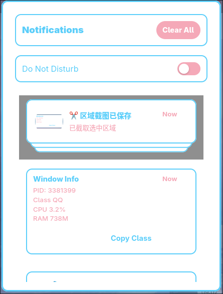 |

###### 使用 `paru` 安装

```bash
paru -S swaync
```

我的配置文件非常简单, 直接软链即可：

```bash
ln -sf ~/.lian/swaync ~/.config/swaync
```

## | hyprlock

`hyprlock` 是一个简单的锁屏软件。


###### 使用 `pacman` 安装

```bash
sudo pacman -S hyprlock
```

如果你想要获得和我一样的效果, 还需要安装这个字体:

```bash
sudo pacman -S ttf-jetbrains-mono-nerd
```

## | wlogout

`wlogout` 提供了一个电源管理页面, 我的配置里分别是 `锁屏` `登出` `关机` `重启`。

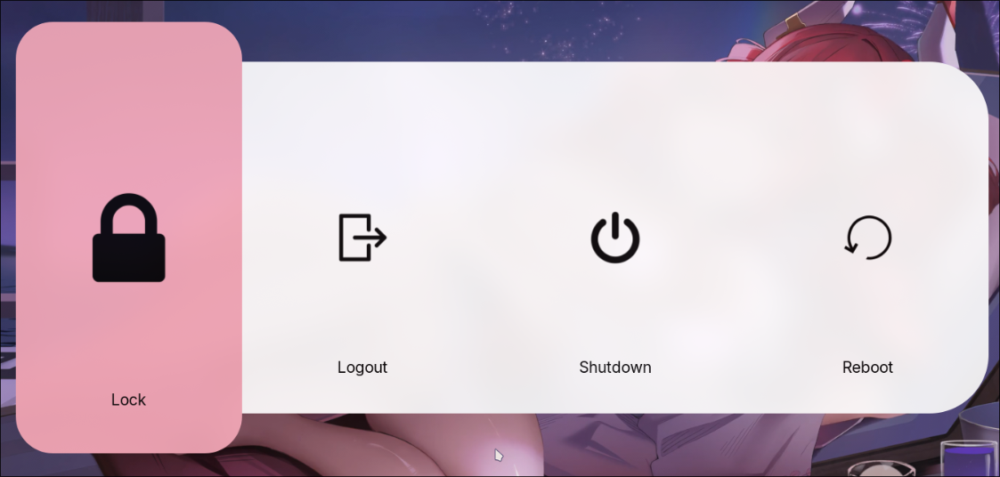

###### 使用 `pacman` 安装

```bash
sudo pacman -S --needed wlogout jq gettext procps-ng
```

锁屏功能依赖 `hyprlock`, 关机功能依赖 `hyprland`。

```
 wlogout
├──  icons                 # 图标
├── 󰡯 layout                # 布局
├──  scripts
│   ├──  logoutlaunch.sh   # 已开就关、没开就开（快捷键入口）
│   └──  wlogout.sh        # 各按钮 action 真正执行的动作
└──  style.css
```

## | Hyprland

本次配置的重头戏之一。`hyprland` 是我心目中最 **linux** 的桌面环境。

###### 使用 `pacman` 安装（可能会漏掉一些包，请以 hypr.land 为准）

```bash
sudo pacman -S hyprland xdg-desktop-portal-hyprland xdg-desktop-portal-gtk \
              qt5-wayland qt6-wayland polkit-gnome
```

* `hyprland`: 混成器，充当窗口管理器，也是显示服务器
* `xdg-desktop-portal-hyprland`: Hyprland 与应用沟通的桥梁
* `xdg-desktop-portal-gtk`: 提供文件选择对话框
* `qt5/6-wayland`: 让基于 qt 框架的应用能跑在 wayland 上
* `polkit-gnome`: 当你执行需要 sudo 权限的 gui 应用时跳出弹窗

关于 `hyprland` 配置详解, 可以直接 [跳转](./hypr/hyprland.conf) 查看注释, 但这里还是做一个简单介绍：

* **修复区:** 一些杂项修复
* **窗口规则:** 定义窗口弹出时的行为，例如浮动模式、弹出大小……
* **NVIDIA:** N 卡修复（如果你刚开始觉得渲染网页/调度 GPU 卡顿是正常的，几天后还卡顿那就不正常了 :)）
* **QT 变量:** 让 QT 高效运行在 wayland 高分屏
* **全局变量:** hyprland 配置文件支持变量，建议把常用目录全部定义为变量
* **自动启动:** 跟随 hyprland 启动的软件
* **窗口外观:** 圆角、边框、颜色、动画……
* **快捷键:** 这部分建议直接抄作业

你可以直接把配置文件丢给 AI 问，如果有一些软件 AI 不认识（比如 `lianwall` `hysp`），那是正常的——这些是我自己写的软件，在我的 [Github](https://github.com/Yueosa) 主页可以找到。

#### 配合 `rofi` `waybar` 的快捷键以及功能

我在 [hypr/hyprland.conf](hypr/hyprland.conf) 里把 `$script_dir` 指向了 `~/.local/bin`，然后所有快捷键都去调用这个目录下的统一入口。

而**真实脚本/配置源文件全部在 `~/.lian`（也就是本仓库）**，并且会软链：

- `~/.config/<软件>` ← `~/.lian/<软件>`
- `~/.local/bin/<分类>/<命令>` ← `~/.lian/.../*.sh`

> 我**不建议**“把脚本直接丢进 `~/.local/bin`”。
> 理由是：`~/.local/bin` 应该全是“稳定的二进制 / 命令名”，源码/配置应留在仓库里集中维护。

仓库里 [bin/README.md](bin/README.md) 提供了一份“可选的 wrapper / 跳板脚本”模板，只是为了更方便地创建软链（不是必须，更推荐你直接软链 `~/.lian/.../*.sh` 到 `~/.local/bin/`）。

##### 脚本权限（重要）

如果你运行快捷键后报 `permission denied`，基本就是脚本没有可执行权限：

```bash
chmod +x \
    ~/.lian/rofi/scripts/rofi-launcher.sh \
    ~/.lian/rofi/cliphist_rofi.sh \
    ~/.lian/wlogout/scripts/*.sh \
    ~/.lian/waybar/lbar \
    ~/.lian/waybar/scripts/*.sh
```

> 因为 `~/.config/*` 只是软链到 `~/.lian/*`，所以给 `~/.lian` 补权限最省事。

##### 创建软链

```bash
mkdir -p ~/.local/bin/{rofi,waybar,wlogout}
# rofi
ln -sf ~/.lian/rofi/scripts/rofi-launcher.sh   ~/.local/bin/rofi/rofi-launcher
ln -sf ~/.lian/rofi/cliphist_rofi.sh           ~/.local/bin/rofi/cliphist
# wlogout
ln -sf ~/.lian/wlogout/scripts/logoutlaunch.sh ~/.local/bin/wlogout/wlogout
# waybar
ln -sf ~/.lian/waybar/scripts/waybar_window.sh             ~/.local/bin/waybar/waybar-window
ln -sf ~/.lian/waybar/scripts/waybar_workspaces_scroll.sh  ~/.local/bin/waybar/waybar-workspaces
ln -sf ~/.lian/waybar/lbar                                 ~/.local/bin/waybar/lbar
```

对应快捷键（来自 [hypr/hyprland.conf](hypr/hyprland.conf)）：

- `SUPER + A`：rofi drun（`~/.local/bin/rofi/rofi-launcher drun`）
- `ALT + TAB`：rofi window（`~/.local/bin/rofi/rofi-launcher window`）
- `SUPER + SPACE`：wlogout（`~/.local/bin/wlogout/wlogout`）
- `SUPER + Z`：剪贴板 rofi（`~/.local/bin/rofi/cliphist`）
- `SUPER + X`：弹出当前窗口信息（`~/.local/bin/waybar/waybar-window show`）—— 见下方 [window](#-当前活动窗口监控-window) 模块
- `SUPER + SHIFT + ←/→/↓`：工作区快速切换（`~/.local/bin/waybar/waybar-workspaces down|up|empty`）

#### Scrolling 无限平铺布局（hyprland-git / 0.54+）

> **前置条件**：需要 `hyprland-git`（AUR）或正式版 0.54+。
> 0.53.x 稳定版不含此功能；升级前建议先做 Timeshift 快照。
> 旧版配置备份存放于 [hypr/hyprland.conf.bak-0.53.3](hypr/hyprland.conf.bak-0.53.3)。

Scrolling 是 Hyprland 新增的一种布局模式，窗口排列在一条 **无限水平卷轴** 上，屏幕作为视口左右滚动浏览，类似 [niri](https://github.com/YaLTeR/niri) 的体验。

我的策略是 **保留 dwindle 为默认布局**，按快捷键随时切换，两种模式自由来回。

##### `scrolling` 块关键配置

| 选项 | 值 | 说明 |
|---|---|---|
| `column_width` | `0.8` | 切入 scrolling 时的默认列宽（屏幕 80%） |
| `follow_focus` | `true` | 焦点切换时视口自动跟随 |
| `follow_min_visible` | `0.4` | 目标窗口低于 40% 可见时才触发跟随 |
| `fullscreen_on_one_column` | `true` | 只剩一列时自动全屏 |

##### 快捷键

| 快捷键 | 功能 | 适用布局 |
|---|---|---|
| `SUPER + S` | 切换 dwindle ↔ scrolling（带通知） | 两者 |
| `SUPER + ←/→/↑/↓` | 焦点切换（scrolling 下左右会自动滚动视口） | 两者 |
| `SUPER + ALT + ←/→` | 把当前窗口移到左/右列 | scrolling |
| `SUPER + ALT + ↑/↓` | 在同列内上下移窗 | scrolling |
| `SUPER + 滚轮下/上` | 视口向右/左滚一列 | scrolling |
| `SUPER + 鼠标右键拖` | 调整列宽 | scrolling |

## | systemd/user

我的 Hyprland 会话里有不少需要长期运行的组件：`waybar`、`swaync`、`fcitx5`、`lianwall`、`cliphist`、`hysp`，以及后来加上的 `hypr-event-daemon`、`lian-updates.timer`。

早期这些东西全写在 `hyprland.conf` 的 `exec-once` 里，配置直观，但排查启动失败、重登后的残留进程、异常退出后的恢复都不太方便。

现在的策略是：

- `hyprland.conf` 仍然作为桌面会话入口
- `exec-once` 只负责导入 Wayland/Hyprland 环境变量，并启动 `hyprland-session.target`
- 常驻组件放在 [systemd/user](systemd/user) 中，由 `systemd --user` 管理生命周期
- `~/.config/systemd/user/*.service|*.target` 只作为软链，源文件维护在 `~/.lian`

会话入口在 [hypr/hyprland.conf](hypr/hyprland.conf)：

```ini
exec-once = dbus-update-activation-environment --systemd WAYLAND_DISPLAY XDG_CURRENT_DESKTOP XDG_SESSION_TYPE XDG_SESSION_DESKTOP HYPRLAND_INSTANCE_SIGNATURE DISPLAY
exec-once = systemctl --user import-environment WAYLAND_DISPLAY XDG_CURRENT_DESKTOP XDG_SESSION_TYPE XDG_SESSION_DESKTOP HYPRLAND_INSTANCE_SIGNATURE DISPLAY
exec-once = systemctl --user start hyprland-session.target
exec-shutdown = systemctl --user stop hyprland-session.target
```

##### 部署软链

```bash
mkdir -p ~/.config/systemd/user

ln -sf ~/.lian/systemd/user/*.service ~/.config/systemd/user/
ln -sf ~/.lian/systemd/user/*.target  ~/.config/systemd/user/
ln -sf ~/.lian/systemd/user/*.timer   ~/.config/systemd/user/

systemctl --user daemon-reload
systemctl --user enable \
    fcitx5.service \
    swaync.service \
    lianwall.service \
    waybar-lbar.service \
    cliphist-watch.service \
    stalk-hypr.service \
    hysp.service \
    tuxedo-tray.service \
    hypr-event-daemon.service \
    lian-updates.timer
```

##### 各 service 简介

| 单元 | 作用 |
|---|---|
| `hyprland-session.target` | 把所有“跟随 Hyprland 会话”的服务挂到这个 target 下，登出时一起停 |
| `waybar-lbar.service` | 用我写的 `lbar` 守护脚本启动 waybar，崩了自动拉起 |
| `swaync.service` | 通知中心 |
| `fcitx5.service` | 输入法 |
| `lianwall.service` | 我自己写的壁纸守护（在 [Github](https://github.com/Yueosa) 主页可以找到） |
| `cliphist-watch.service` | 后台监听 `wl-paste`，写入 cliphist 历史 |
| `stalk-hypr.service` | 我自己写的 Hyprland 状态记录器 |
| `hysp.service` | 我自己写的小工具 |
| `tuxedo-tray.service` | TUXEDO 笔记本控制中心托盘 |
| `hypr-event-daemon.service` | **新增**：监听 Hyprland `.socket2.sock` 事件，把 active window/workspace 写到缓存，给 waybar 发信号（替代 1s 轮询） |
| `lian-updates.timer` + `lian-updates.service` | **新增**：每 30 分钟跑一次 `checkupdates + paru -Qua`，写缓存，给 waybar 发信号 |

##### 管理命令

```bash
systemctl --user status hyprland-session.target
systemctl --user status waybar-lbar swaync fcitx5 lianwall hypr-event-daemon
systemctl --user restart waybar-lbar
journalctl --user -u swaync -b
systemctl --user list-timers           # 看 lian-updates 下次什么时候跑
```

`hyprland-session.target.wants/` 这类目录不需要手动维护；它们是 `systemctl --user enable` 之后生成的本机状态。

## | nvim

`nvim` 是一款比 `vim` 更强的文本编辑器，我目前对它进行了 `rust` 和 `markdown` 的定制化。

| rust 开发体验 | markdown 体验 |
|-|-|
|  |  |

###### 使用 `pacman` 安装

```bash
sudo pacman -S neovim
```

部署：

```bash
ln -sf ~/.lian/nvim ~/.config/nvim
```

如果你已经有自己的 nvim 配置，可以只参考 `lua/` 里的模块结构。

##### 目录结构

```
 nvim
├──  init.lua
├──  lazy-lock.json
├──  lua
│   ├──  core
│   │   ├──  options.lua      # 基础选项（缩进/行号/分屏方向 ...）
│   │   ├──  autocmds.lua     # 全局自动命令
│   │   └──  keymaps.lua      # 全局快捷键（K / <leader>f* / 诊断跳转）
│   └──  plugins
│       ├──  init.lua         # lazy.nvim 引导 + 聚合 specs
│       └──  specs            # 每类插件一个文件
│           ├──  ui.lua          # nvim-tree + render-markdown
│           ├──  lsp.lua         # lspconfig + mason + mason-lspconfig
│           ├──  cmp.lua         # nvim-cmp + LuaSnip + cmp-nvim-lsp/buffer/path
│           ├──  treesitter.lua  # nvim-treesitter（自动装 parser）
│           ├──  rust.lua        # rustaceanvim
│           ├──  telescope.lua
│           ├──  whichkey.lua
│           ├──  comment.lua
│           ├──  autopairs.lua
│           ├──  git.lua         # vim-fugitive + gitsigns
│           └──  venv.lua        # python venv 选择器
└──  sakurine                 # 我自己写的主题（colorscheme），不是第三方主题包
    ├──  autoload
    └──  colors
```

##### 插件清单

我使用 [lazy.nvim](https://github.com/folke/lazy.nvim) 管理插件（`init.lua` 自举克隆）。当前实际启用的插件：

| 模块 | 插件 |
|---|---|
| 文件树 / Markdown | `nvim-tree.lua`、`render-markdown.nvim` |
| LSP | `nvim-lspconfig` + `mason.nvim` + `mason-lspconfig.nvim`（默认装 `lua_ls` / `pyright` / `vtsls`） |
| 补全 | `nvim-cmp` + `LuaSnip` + `cmp-nvim-lsp` / `cmp-buffer` / `cmp-path` / `cmp_luasnip` |
| 语法 | `nvim-treesitter`（rust/lua/python/c/asm/dart/html/css/js/ts/vue/json/toml/sql/markdown 等） |
| Rust | `rustaceanvim`（直接接管 rust-analyzer，不走 lspconfig） |
| 模糊搜索 | `telescope.nvim` |
| Git | `vim-fugitive`、`gitsigns.nvim` |
| 体验 | `which-key.nvim`、`comment.nvim`、`nvim-autopairs` |
| Python | venv 选择器 |

系统依赖：

```bash
sudo pacman -S --needed neovim git curl tree-sitter-cli
```

> - `tree-sitter-cli` 用于 `nvim-treesitter` 自动安装/更新解析器；缺它启动时会 WARN 但不报错。
> - LSP server 由 `mason.nvim` 在 nvim 内部管理（`:Mason`），不需要 pacman 装。

##### 常用快捷键

> `<leader>` = 空格键（Space）。

| 键 | 功能 |
|---|---|
| `<leader>w` | 切换文件树（nvim-tree） |
| `<leader>e` | 在「文件树 / 编辑区」之间切焦点 |
| 文件树里 `v` | 竖分屏打开选中文件 |
| `<leader>ff` / `fg` / `fb` / `fh` | Telescope：文件 / 文本 / Buffer / 帮助 |
| `<leader>dd` / `]d` / `[d` | 诊断详情 / 下一处 / 上一处 |
| `<leader>ca` | 代码操作（rust 内由 rustaceanvim 接管） |
| `K` | 悬停文档（带圆角 border） |

忘了的话直接按 `Space` 等 `which-key` 弹出提示即可。

## | waybar

`waybar` 是专为 wayland 设计的 **高定制、强性能、可无限拓展** 的状态栏。这是本配置最复杂的一块。

###### 使用 `pacman` 安装 + 全部依赖

> 我推荐你先阅读后面的各模块说明再来逐步安装。
> **一条命令梭哈完的话，你后续管理/自定义起来会很麻烦。**

```bash
sudo pacman -S --needed \
    waybar \
    python \
    playerctl cava \
    btop \
    networkmanager \
    pavucontrol \
    bluez blueman \
    wl-clipboard cliphist \
    pacman-contrib \
    libnotify
```

如果你要启用 AUR 更新统计（`custom/updates` 的 AUR 部分），以及使用 `nmrs` / `lian` 这类 AUR 社区软件：

```bash
paru -S --needed nmrs lian
```

可选依赖（点击动作会用到）：

```bash
sudo pacman -S --needed gsimplecal
```

> - `pacman-contrib` 提供 `checkupdates`（官方仓库更新统计）。
> - `playerctl` 用于媒体模块；`cava` 用于音频频谱。
> - `bluez`/`blueman` 用于蓝牙模块。
> - `libnotify` 提供 `notify-send`（窗口信息弹窗用）。
> - `wl-clipboard` 用于复制（窗口弹窗里 “复制 Class” 时会用到）。

##### 部署

```bash
ln -sf ~/.lian/waybar ~/.config/waybar
```

通过 `systemd --user` 启动：

```bash
systemctl --user restart waybar-lbar
```

`lbar` 是我给 waybar 写的守护脚本：waybar 崩了会自动重启。

##### 目录结构

```
 waybar
├──  config.jsonc            # 主配置：组装各模块（include + group/island-*）
├──  style.css               # 样式入口：只负责 @import（已模块化）
├──  theme.css               # 主题变量：颜色 @define-color
├── 󰡯 lbar                    # waybar 守护脚本：waybar 崩了自动拉起
├──  style/                  # animations / base / islands / modules / tooltip / tray-menu
├──  modules/                # 每个模块一个 jsonc：18 个 (workspaces/window/clock/cpu/gpu/...)
└──  scripts/                # 自定义脚本：sh 入口 + py 主体
    └──  py                  # cava_gate / hypr_event_daemon / waybar_*.py
```

##### 关于 “on-scroll = :” 的细节

Waybar 有个很烦的小坑：某些模块没有配置滚轮动作时，如果你手贱在它上面滚一下，Waybar 可能会直接崩。

所以我在很多模块里都显式写了：

```jsonc
"on-scroll-up": ":",
"on-scroll-down": ":"
```

它的含义是 “啥也不做”，但能避免 Waybar 因为缺少 action 而崩掉。

##### 效果预览

> ⚠️ **图片可能略过时**：模块的迭代频率比 README 高。下面给的图只是大概样子，最准的永远是源代码。

<table align="center">
  <tr>
    <td align="center"><b>左侧岛屿</b><br><sub>工作区 / logo / 窗口</sub><br></td>
    <td align="center"><b>焦点窗口信息</b><br><sub>active window</sub><br>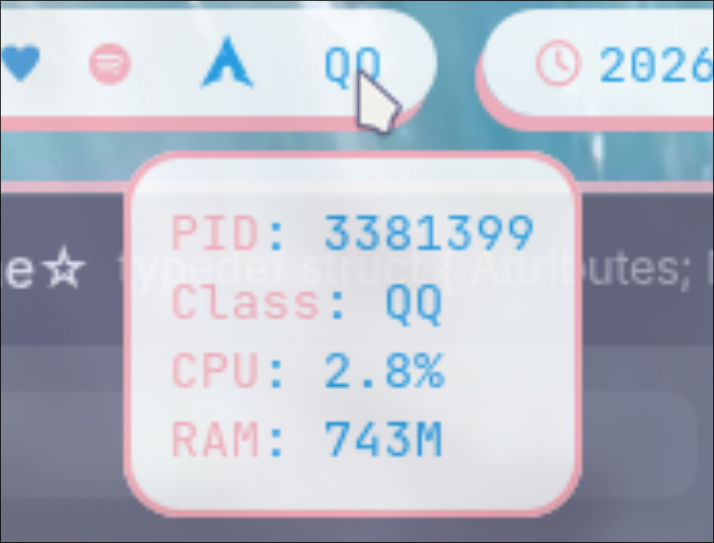</td>
  </tr>
  <tr>
    <td align="center"><b>时间显示</b><br><sub>三档显示模式</sub><br></td>
    <td align="center"><b>显卡监控</b><br><sub>NVIDIA</sub><br>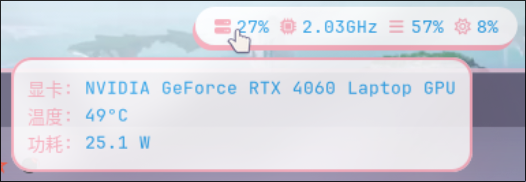</td>
  </tr>
  <tr>
    <td align="center"><b>CPU 监控</b><br><sub>使用率 + 温度/功耗</sub><br>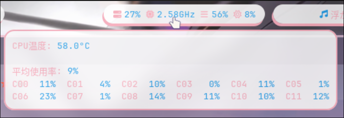</td>
    <td align="center"><b>内存监控</b><br><sub>RAM/Swap + Top 5 (PSS)</sub><br>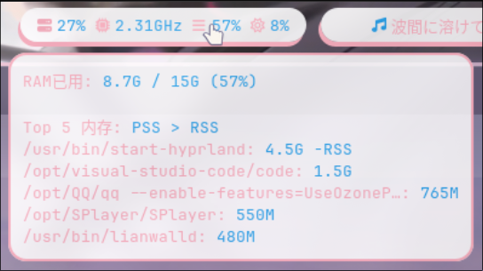</td>
  </tr>
  <tr>
    <td align="center"><b>媒体信息 / 音频可视化</b><br><sub>播放器 + 歌词 + cava</sub><br>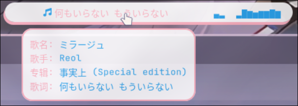</td>
    <td align="center"><b>右侧岛屿</b><br><sub>网络 / 音量 / 电池 / 蓝牙 ...</sub><br></td>
  </tr>
  <tr>
    <td align="center"><b>网络信息</b><br><sub>NetworkManager</sub><br>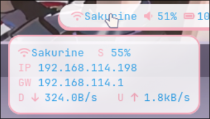</td>
    <td align="center"><b>蓝牙信息</b><br><sub>blueman</sub><br>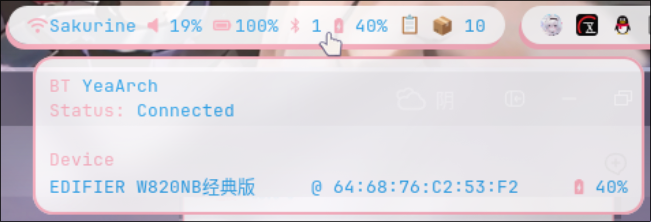</td>
  </tr>
  <tr>
    <td align="center"><b>包管理器</b><br><sub>checkupdates + paru -Qua</sub><br>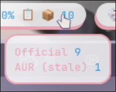</td>
    <td align="center"><b>系统托盘</b><br><sub>tray</sub><br></td>
  </tr>
  <tr>
    <td align="center" colspan="2"><b>托盘右键菜单样式</b><br><sub>style/tray-menu.css</sub><br>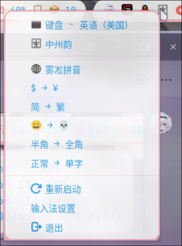</td>
  </tr>
</table>

#### 因为 waybar 配置比较复杂，所以放到最后详解

##### 我的开发规范

- 在 `jsonc` 模块里调用 `shell` 脚本作为入口
- 当 `shell` 不足以承载逻辑（过于臃肿）时，由 shell 转发给 `py` 脚本

##### 脚本头注释规范

每一个脚本（sh / py）开头都有详细的注释，写清「用途 / 调用方 / 输出 / 依赖」。如果模块不工作，可以从这一段开始定位：

**shell 脚本注释示例**

```shell
# ----------------------------------------------------------------------
# 脚本：waybar_media.sh
# 用途：Waybar 自定义媒体/歌词模块入口。
# 使用位置：
#   - modules/media.jsonc -> custom/media (return-type=json)
# 调用：
#   - python scripts/py/waybar_media.py（常驻循环 + 流式输出）
# 退出码：
#   - 0：即使缺依赖也返回 JSON（避免 Waybar 判定模块失败）
# ----------------------------------------------------------------------
```

**python 脚本注释示例**

```python
"""Waybar 内存/Swap 模块（输出 JSON）。

用途：显示 RAM 与 Swap 的使用百分比，并在 tooltip 里列出 Top 5 内存占用的应用组。

实现要点：
- 百分比来自 /proc/meminfo。
- Top 5 优先使用 /proc/<pid>/smaps_rollup 的 PSS（更接近真实占用），拿不到则回退 RSS。

输出：stdout 单行 JSON：{"text": "…", "tooltip": "…"}
依赖：Python 标准库（无需第三方包）。
"""
```

---

## 附录: Waybar 各模块配置详解

##### | 当前工作区显示 ws_current

文件：`modules/ws_current.jsonc`

功能：只显示“当前在哪个工作区”的单字符指示器（圈号/数字）。

- **数据源**：`~/.cache/waybar/active_workspace.json`，由 [hypr-event-daemon](systemd/user/hypr-event-daemon.service) 在 Hyprland 工作区切换事件触发时原子写入；缓存缺失时脚本回退到 `hyprctl activeworkspace -j`
- **触发**：模块 `interval: "once"` + `signal: 13`，daemon 写完缓存后 `pkill -RTMIN+13 waybar`
- **脚本**：`scripts/py/waybar_ws_current.py`
- **依赖**：`hyprctl`、`python3`

##### | 所有工作区状态 workspaces

文件：`modules/workspaces.jsonc`

功能：使用 Waybar 原生 `hyprland/workspaces` 模块显示所有工作区状态。

- 左键：点击切换工作区（`on-click: activate`）
- 滚轮：切换到上/下一个 “已有窗口或当前” 的工作区
  - 脚本：`scripts/waybar_workspaces_scroll.sh` → `scripts/py/waybar_workspaces_scroll.py`
- 依赖：`hyprctl`、`python3`

> 我的 jsonc 与 python 中有如下硬编码配置，这是个人使用习惯，可以直接改源代码：

| 工作区序号 | 说明 | 默认图标 | 是否默认显示 |
|-|-|-|-|
| `1` `2` `3` | 代码区 | `󰅩` | `1` 默认显示；`2` `3` 按需出现 |
| `4` `5` `6` | 游戏区 | `󰓓` | `4` 默认显示；`5` `6` 按需出现 |
| `7` | 其它/杂项 | `󰏘` | 按需出现 |
| `8` | 媒体 | `󰭹` | 默认显示 |
| `9` | 社交/聊天 | `󰭹` | 默认显示 |
| `10` | 代理/音乐 | `󰓇` | 默认显示 |

> 「是否默认显示」对应 `modules/workspaces.jsonc` 里的 `persistent-workspaces`：被列出来的工作区即使空着也会显示。

##### | 图标 arch_logo

文件：`modules/logo.jsonc`

功能：显示一个 Arch 图标。

- 左键：打开 AUR 网站

##### | 当前活动窗口监控 window

文件：`modules/window.jsonc`

功能：显示当前活动窗口标题，tooltip 展示 PID/Class/CPU/RAM。

- **数据源**：`~/.cache/waybar/active_window.json`，由 [hypr-event-daemon](systemd/user/hypr-event-daemon.service) 在窗口切换/标题变更时写入；缓存缺失时回退 `hyprctl activewindow -j`
- **触发**：模块 `interval: "once"` + `signal: 12`
- **脚本**：`scripts/waybar_window.sh` → `scripts/py/waybar_window.py`
- **额外玩法**：`SUPER+X` 触发 `scripts/waybar_window.sh show` —— 用 `notify-send` 弹窗显示窗口的 PID / Class / CPU / RAM（来自 [scripts/py/waybar_window_popup.py](waybar/scripts/py/waybar_window_popup.py)）；同时让模块本身短暂高亮（hot）
- **额外动作**：`waybar_window.sh copy-class` 复制窗口 Class（优先 `wl-copy`，没有就用 `xclip`）
- **依赖**：`hyprctl`、`python3`；可选 `libnotify` / `wl-clipboard`

##### | 时间和日期显示 clock

文件：`modules/clock.jsonc`

功能：日期/时间显示（右键切换显示模式）。

- 左键：打开 `gsimplecal`（极简日历弹窗，见 [gsimplecal](#gsimplecal) 章节）
- 右键：切换显示模式（分三档），并 `pkill -RTMIN+11 waybar` 立即刷新
- 脚本：`scripts/waybar_clock.sh` + `scripts/waybar_clock_toggle.sh` → `scripts/py/waybar_clock.py`
- 依赖：`python3`；可选 `gsimplecal`

##### | 显卡监控 gpu

文件：`modules/gpu.jsonc`

功能：NVIDIA 显卡监控。

- **显示优先级**：使用率 > VRAM 占用 > 温度（任何一个超阈就高亮）
- **采集**：单次 `nvidia-smi --query-gpu=name,utilization.gpu,power.draw,temperature.gpu,memory.used,memory.total ...`
- 脚本：`scripts/waybar_gpu.sh` → `scripts/py/waybar_gpu.py`
- 左键：在 `kitty` 里打开 `nvidia-smi` 实时监控
- 依赖：`nvidia-utils`（提供 `nvidia-smi`）、`kitty`

##### | cpu 监控 cpu

文件：`modules/cpu.jsonc`

功能：CPU 使用率监控 + tooltip 详细信息（尽量展示温度/功耗/频率等）。

- 脚本：`scripts/waybar_cpu.sh` → `scripts/py/waybar_cpu.py`
- 左键：打开 `btop`
- 依赖：`python3`；可选 `lm_sensors`（提供 `sensors`，温度/功耗更准）

> 部分 CPU 信息不好拿，所以只能保证尽量展示，但作者本人使用环境下并未出错过。

##### | 内存与 swap 监控 memory

文件：`modules/memory.jsonc`

功能：显示 RAM / Swap 使用率；tooltip 显示 Top 5 内存占用（按“应用组”聚合）。

- 脚本：`scripts/waybar_memory.sh` → `scripts/py/waybar_memory.py`
- 左键：打开 `btop`
- 依赖：`python3`

> 内存统计优先使用 PSS（更精确），如果某些进程读不到 smaps_rollup 则部分降级为 RSS（会有“数值虚高”的现象）。tooltip 顶部会标注当前模式：`Top 5 内存 (PSS)` 或 `Top 5 内存 (PSS, ⚠ 部分 RSS)`。

##### | 媒体显示器 media

文件：`modules/media.jsonc`

功能：显示当前播放器状态与文本（**优先歌词**）。

- **运行模式**：常驻循环（无 `interval`，`exec` 直接持续输出）
  - 每 1 秒做一次 `playerctl` 真值校准（status / metadata / position 各 1 fork）
  - 每 ~150ms 用单调时间外推位置，计算当前应该显示哪一句歌词
  - 输出仅在 JSON 变化时才打印 → 实测常驻 CPU ~0.4%
  - 实现：[scripts/py/waybar_media.py](waybar/scripts/py/waybar_media.py)
- **歌词来源**：
  1. `xesam:url` 旁边的同名 `.lrc`
  2. 环境变量 `WAYBAR_LYRICS_DIRS` 列出的目录（冒号分隔）
  3. `~/.lyrics/*.lrc`
  4. 如果是 [SPlayer](https://github.com/imsyy/SPlayer)，直接读它的 `cache.db` 拿带时间戳的歌词
- **入口脚本**：`scripts/waybar_media.sh` → 上述 py
- **控制脚本**：`scripts/waybar_media_ctl.sh`（保证“点击控制的就是当前显示的播放器”）
- **左键**：播放/暂停
- **滚轮**：上一首 / 下一首
- **右键**：聚焦播放器窗口（`scripts/waybar_media_focus.sh` → `scripts/py/waybar_media_focus.py`，依赖 `hyprctl`）
- **依赖**：`playerctl`、`python3`；右键聚焦需要 `hyprctl`

##### | 音频可视化 cava

文件：`modules/cava.jsonc`

功能：音频频谱可视化（**无音频时自动挂起 cava**，省 CPU）。

- **入口**：`scripts/waybar_cava.sh`（长驻自恢复）
  - `cava -p ~/.config/cava/config_waybar` 输出 raw 数值
  - `scripts/py/waybar_cava_proc.py` 把数值映射为 8 级方块字符
- **静音 gate**：[scripts/py/cava_gate.py](waybar/scripts/py/cava_gate.py)
  - 通过 `pactl subscribe` + 解析 `pactl list sink-inputs` 的 `Corked: no` 检测有没有音频流
  - 静音 5 秒后给 cava 发 `SIGSTOP` 挂起，恢复时 `SIGCONT`
  - 退出时先 `SIGCONT` 再 kill，避免遗留 STOPped 进程
- **依赖**：`cava`、`python3`、`pactl`

> 注意：你需要准备 `~/.config/cava/config_waybar`，否则模块会持续输出空行等待你修复。本仓库已经有一份 [cava/config_waybar](cava/config_waybar)，参考前文 [cava](#-cava) 章节部署。

##### | 网络模块 network

文件：`modules/network.jsonc`

功能：Waybar 原生网络模块，显示 Wi-Fi SSID / 有线 / 断开状态。

- 左键：运行 `nmrs`（AUR，窗口类名 `org.netrs.ui`）
- 右键：在终端里打开 `nmtui`（`scripts/waybar_open_nmtui.sh` 自动找终端）
- 依赖：`networkmanager`（提供 `nmtui`）

安装 `nmrs`：

```bash
paru -S --needed nmrs
```

> 没有 `nmrs` 的话，把 `on-click` 改成 `nmtui` / `nm-connection-editor` 即可。

##### | 音频控制 pulseaudio

文件：`modules/pulseaudio.jsonc`

功能：音量显示与控制（Waybar 原生 pulseaudio 模块；PipeWire 也兼容）。

- 左键：打开 `pavucontrol -t 3`
- 右键：静音切换（`pactl set-sink-mute @DEFAULT_SINK@ toggle`）
- 滚轮：调音量（步进 1）
- 依赖：`pavucontrol`、`pactl`（来自 `pulseaudio` 或 `pipewire-pulse`）

##### | 电池信息 battery

文件：`modules/battery.jsonc`

功能：电池容量显示。

- 左键：打开 `/opt/tuxedo-control-center/tuxedo-control-center`

> 不是 TUXEDO 设备就把 `on-click` 改成你的电源管理器。

##### | 蓝牙模块 bluetooth

文件：`modules/bluetooth.jsonc`

功能：显示蓝牙开关、连接数（以及单设备电量）。

- 左键：打开 `blueman-manager`
- 依赖：`bluez`（bluetoothctl）、`blueman`（GUI）

蓝牙服务建议开机自启：

```bash
sudo systemctl enable --now bluetooth
```

##### | 系统更新 updates

文件：`modules/updates.jsonc`

功能：统计官方仓库 + AUR 的可更新数量。

- **采集策略（已重构）**：不再由 waybar 实时拉取，改为 [systemd timer](systemd/user/lian-updates.timer) 后台采集
  - `lian-updates.timer` 每 30 分钟跑一次（开机 1 分钟后首跑）
  - `lian-updates.service` 调 [scripts/updates_fetch.sh](waybar/scripts/updates_fetch.sh)：跑 `checkupdates` + `paru -Qua`，原子写入 `~/.cache/waybar/updates.json`，最后 `pkill -RTMIN+8 waybar`
- **模块端**：`scripts/waybar_updates.sh` → `scripts/py/waybar_updates.py` 只读缓存格式化输出
- **左键**：`kitty -e lian`
- **依赖**：`pacman-contrib`（checkupdates）、`paru`（AUR 统计）、`kitty`、`lian`

安装 `lian`：

```bash
paru -S --needed lian
```

> `lian` 是我自己开发的包管理器前端, 对新手非常友好, 你可以在我的 [Github](https://github.com/Yueosa/lian) 详细了解。

##### | 系统托盘 tray

文件：`modules/tray.jsonc`

功能：系统托盘（后台应用图标）。

- 样式：右键菜单样式在 `style/tray-menu.css`

##### | (未启用) backlight

文件：`modules/backlight.jsonc`

我这份配置里暂时没启用它；如果你是笔记本并且需要亮度条，可以按需启用。
